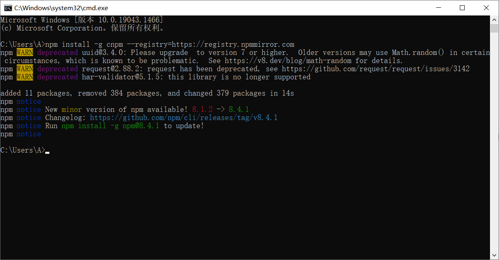

## 命令行工具


在正式讲解ES6新特性之前，我们需要了解一些命令行工具，在日后的课程中，我们会经常用到命令行


常用命令行工具有两种

1. `CMD` 命令行工具
2. `PowerShell` 命令行工具


### CMD命令行

1. 打开命令行窗口
   1. win：左下角开始，找到运行，点击，输入`cmd`，回车
   2. win：`win+r` 快速打开命令行窗口
   3. mac：command + 空格，输入`terminal`
2. 选择盘符：盘符名加冒号`E:`
3. 查看盘符及目录下文件与文件夹：`win:dir   mac:ls`
4. 清空命令行信息：`win:cls  mac:clear`
5. 进入文件夹或目录：`cd  文件夹名称`
6. 返回到上一级目录：`cd ../`
7. 快速补全目录或文件夹名称：`tab`
8. 创建文件夹：`mkdir 文件夹名称`
9. 查看历史输入过的命令：上下按键


### PowerShell

1. 打开方式
   1. 在开始位置搜索`PowerShell`打开
   2. 在对应目录按住`shift`+右键，打开
2. 其他保持一直


**实时效果反馈**

**1. 如何快速打开`CMD`命令行工具：**

<font style="background-color:rgb(233, 30, 100)">A</font>   `win+R`

<font style="background-color:rgb(255, 197, 10)">B</font>   `win+E`

<font style="background-color:#8bc34a">C</font>   `win+P`

<font style="background-color:rgb(2, 170, 244);">D</font>   `win+L`


**2. `CMD`命令行中进入文件夹或目录：**

<font style="background-color:rgb(233, 30, 100)">A</font>   `win+R`

<font style="background-color:rgb(255, 197, 10)">B</font>   `mkdir 文件夹名称`

<font style="background-color:#8bc34a">C</font>   `cd ../`

<font style="background-color:rgb(2, 170, 244);">D</font>   `cd  文件夹名称`


**答案**

1=>A    2=>D


## ECMAScript 6 简介


### ECMAScript 和 JavaScript 的关系

ECMAScript 和 JavaScript 的关系是，前者是后者的规格，后者是前者的一种实现，常场合，这两个词是可以互换的。


### 名称详解

ECMAScript 6（以下简称 ES6）是 JavaScript 语言的标准，在 2015 年 6 月发布。它的目标，是使得 JavaScript 语言可以用来编写复杂的大型应用程序，成为企业级开发语言。

| 版本    | 官方名称                            | **发布日期** |
| ------- | ----------------------------------- | ------------ |
| ES1     | ECMAScript 1                        | 1997         |
| ES2     | ECMAScript 2                        | 1998         |
| ES3     | ECMAScript 3                        | 1999         |
| ES4     | ECMAScript 4                        | 从未发布过   |
| ES5     | ECMAScript 5                        | 2009         |
| ES5.1   | ECMAScript 5.1                      | 2011         |
| **ES6** | **ECMAScript 2015（ECMAScript 6）** | **2015**     |
| ES7     | ECMAScript 2016                     | 2016         |
| ES8     | ECMAScript 2017                     | 2017         |
| ...     | ...                                 | ...          |

因此，ES6 既是一个历史名词，也是一个泛指，含义是 5.1 版以后的 JavaScript 的下一代标准，涵盖了 ES2015、ES2016、ES2017 等等


### 语法提案的批准流程

任何人都可以向标准委员会（又称 TC39 委员会）提案，要求修改语言标准。

一种新的语法从提案到变成正式标准，需要经历五个阶段。每个阶段的变动都需要由 TC39 委员会批准。

- Stage 0 - Strawman（展示阶段）
- Stage 1 - Proposal（征求意见阶段）
- Stage 2 - Draft（草案阶段）
- Stage 3 - Candidate（候选人阶段）
- Stage 4 - Finished（定案阶段）

一个提案只要能进入 Stage 2，就差不多肯定会包括在以后的正式标准里面。ECMAScript 当前的所有提案，可以在 TC39 的官方网站[GitHub.com/tc39/ecma262](https://github.com/tc39/ecma262)查看。


### ES6带来的新特性

1. `let` 和 `const` 命令
2. 变量的解构赋值
3. 字符串扩展
4. 函数扩展
5. 对象扩展
6. 数组扩展
7. 运算符扩展
8. Promise对象
9. Class
10. Class 继承
11. ...


## Nodejs环境安装


本节课为前置课程，在接下来的ES6课程中，我们需要先安装Nodejs环境


### Nodejs简介

Nodejs诞生于2009年，主攻服务器方向，使得利用`JavaScript`也可以完成服务器代码的编写


### Nodejs安装

> **Nodejs官网**
>
> https://nodejs.org/en/

Nodejs的安装与一般软件一样


### 大量的库

在安装`Nodejs`的同时，会附带一个`npm`命令，`npm` 是Node的包管理工具，这样正是接下来我们要用到的

npm 的简单结构有助于 Node.js 生态系统的激增，现在 npm 仓库托管了超过 1,000,000 个可以自由使用的开源库包


### `npm`镜像

由于服务器在国外，所以下载速度比较慢，我们可以用国内的镜像

> **阿里镜像地址**
>
> https://npmmirror.com/

在命令行运行如下命令即可

```bash
npm install -g cnpm --registry=https://registry.npmmirror.com
```

看到如下信息，代表安装成功




## Babel转码器


Babel 是一个广泛使用的 ES6 转码器，可以将 ES6 代码转为 ES5 代码，从而在老版本的浏览器执行。这意味着，你可以用 ES6 的方式编写程序，又不用担心现有环境是否支持

> **浏览器支持性查看**
>
> https://caniuse.com/
>
> **Babel官网**
>
> https://babeljs.io/


### 转码示例

原始代码用了箭头函数，Babel 将其转为普通函数，就能在不支持箭头函数的 JavaScript 环境执行了

```js
// 转码前
input.map(item => item + 1);

// 转码后
input.map(function (item) {
  return item + 1;
});
```


### Babel安装流程

#### 第一步：安装 Babel

```js
npm install --save-dev @babel/core
```


#### 第二步：配置文件`.babelrc`

Babel 的配置文件是.babelrc，存放在项目的根目录下。使用 Babel 的第一步，就是配置这个文件。

该文件用来设置转码规则和插件，基本格式如下

```js
{
  "presets": [],
  "plugins": []
}
```


#### 第三步：转码规则

presets字段设定转码规则，官方提供以下的规则集，你可以根据需要安装

```js
npm install --save-dev @babel/preset-env
```


#### 第四步：将规则加入`.babelrc`

```js
{
    "presets": [
      "@babel/env"
    ],
    "plugins": []
}
```


### Babel命令行转码

Babel 提供命令行工具`@babel/cli`，用于命令行转码

```js
npm install --save-dev @babel/cli
```

基本用法如下

```js
# 转码结果输出到标准输出
$ npx babel example.js

# 转码结果写入一个文件
# --out-file 或 -o 参数指定输出文件
$ npx babel example.js --out-file compiled.js
# 或者
$ npx babel example.js -o compiled.js

# 整个目录转码
# --out-dir 或 -d 参数指定输出目录
$ npx babel src --out-dir lib
# 或者
$ npx babel src -d lib
```


**实时效果反馈**

**1. Babel的作用是什么：**

<font style="background-color:rgb(233, 30, 100)">A</font>   Babel是ES6的一部分，是ES6的新特性

<font style="background-color:rgb(255, 197, 10)">B</font>   Babel是ES6的转码器，可以将 ES6 代码转为 ES5 代码

<font style="background-color:#8bc34a">C</font>   Babel是配置文件，配置ES6环境

<font style="background-color:rgb(2, 170, 244);">D</font>   Babel是ES5的基础知识


**2. 下列哪个是安装Babel命令转码工具：**

<font style="background-color:rgb(233, 30, 100)">A</font>   `npm install --save-dev @babel/core`

<font style="background-color:rgb(255, 197, 10)">B</font>   `npm install --save-dev @babel/preset-env`

<font style="background-color:#8bc34a">C</font>   `npm install --save-dev @babel/cli`

<font style="background-color:rgb(2, 170, 244);">D</font>   `npx babel example.js`


**答案**

1=>B     2=>C


##  Let 命令


`ES6 `新增了`let`命令，用来声明变量。它的用法类似于`var`，但是所声明的变量，只在`let`命令所在的代码块内有效。


### let块级作用域

```js
{
  let itbaizhan = 10;
  var sxt = 1;
}

itbaizhan // ReferenceError: itbaizhan is not defined.
sxt // 1
```


`for`循环的计数器，就很合适使用`let`命令

```js
for (let i = 0; i < 10; i++) {
  // ...
}

console.log(i);
// ReferenceError: i is not defined
```


对比`var`和`let`在循环中的应用

```js
var a = [];
for (var i = 0; i < 10; i++) {
  a[i] = function () {
    console.log(i);
  };
}
a[6](); // 10
```

上面代码，输出的`10`,而我们期待的是`6`

```js
var a = [];
for (let i = 0; i < 10; i++) {
  a[i] = function () {
    console.log(i);
  };
}
a[6](); // 6
```

上面代码，输出的`6`


### let不存在变量提升

`var`命令会发生“变量提升”现象，即变量可以在声明之前使用，值为`undefined`。这种现象多多少少是有些奇怪的，按照一般的逻辑，变量应该在声明语句之后才可以使用

为了纠正这种现象，`let`命令改变了语法行为，它所声明的变量一定要在声明后使用，否则报错。

```js
// var 的情况
console.log(foo); // 输出undefined
var foo = 2;

// let 的情况
console.log(bar); // 报错ReferenceError
let bar = 2;
```


### let不允许重复声明

`let`不允许在相同作用域内，重复声明同一个变量。

```js
// 报错
function func() {
  let a = 10;
  var a = 1;
}

// 报错
function func() {
  let a = 10;
  let a = 1;
}
```


**实时效果反馈**

**1. 下列那个不是Let的特性：**

<font style="background-color:rgb(233, 30, 100)">A</font>   Let是块级作用域

<font style="background-color:rgb(255, 197, 10)">B</font>   Let不存在变量提升

<font style="background-color:#8bc34a">C</font>   Let不允许重复声明

<font style="background-color:rgb(2, 170, 244);">D</font>   Let和Var一样并没有区别


**答案**

1=>D


## Const 命令


`const`声明一个只读的常量。一旦声明，常量的值就不能改变

```js
const PI = 3.1415;
PI // 3.1415

PI = 3;
// TypeError: Assignment to constant variable.
```


`const`声明的变量不得改变值，这意味着，`const`一旦声明变量，就必须立即初始化，不能留到以后赋值

```js
const foo;
// SyntaxError: Missing initializer in const declaration
```


`const`的作用域与let命令相同：只在声明所在的块级作用域内有效

```js
if (true) {
  const MAX = 5;
}

MAX // Uncaught ReferenceError: MAX is not defined
```


`const`命令声明的常量也是不存在提升

```js
if (true) {
  console.log(MAX); // ReferenceError
  const MAX = 5;
}
```


`const`声明的常量，也与`let`一样不可重复声明

```js
var message = "Hello!";
let age = 25;

// 以下两行都会报错
const message = "Goodbye!";
const age = 30;
```


**实时效果反馈**

**1. 下列`const`特性描述错误的是：**

<font style="background-color:rgb(233, 30, 100)">A</font>   `const`命令声明的常量不提升

<font style="background-color:rgb(255, 197, 10)">B</font>   `const`命令不可重复声明

<font style="background-color:#8bc34a">C</font>   `const`命令是块级作用域

<font style="background-color:rgb(2, 170, 244);">D</font>   `const`命令声明可以改变


**答案**

1=>D


## 对象解构赋值


解构可以用于对象

```js
let {name,age} = {name:"iwen",age:20};
```

> **温馨提示**
>
> 对象的属性没有次序，变量必须与属性同名，才能取到正确的值

```js
let {age,name} = {name:"iwen",age:20};
age // 20
```

```js
let {sex,age,name} = {name:"iwen",age:20};
sex // undefined
```

对象的解构赋值，可以很方便地将现有对象的方法，赋值到某个变量

```js
let { random,floor } = Math;
let { log } = console;
```

注意事项，如果要将一个已经声明的变量用于解构赋值，必须非常小心

```js
let hello = "Hello";
let { hello } = {hello:"hello"}; // 报错

let hello = "Hello";
({ hello } = {hello:"hello"}); // 正确
```


**实时效果反馈**

**1. 下列对象解构赋值的代码，输出结果是多少：**

```js
let hello = "Hello";
let { hello } = {hello:"hello"}; 
console.log(hello);
```

<font style="background-color:rgb(233, 30, 100)">A</font>   `hello`

<font style="background-color:rgb(255, 197, 10)">B</font>   `Hello`

<font style="background-color:#8bc34a">C</font>   报错

<font style="background-color:rgb(2, 170, 244);">D</font>   `undefined`


**答案**

1=>C


## 字符串扩展


### 字符串Unicode 表示法

ES6 加强了对 Unicode 的支持，允许采用`\uxxxx`形式表示一个字符，其中`xxxx`表示字符的 Unicode 码点。


#### Unicode

统一码（Unicode），也叫万国码、单一码，是计算机科学领域里的一项业界标准，包括字符集、编码方案等。Unicode是为了解决传统的字符编码方案的局限而产生的，它为每种语言中的每个字符设定了统一并且唯一的二进制编码，以满足跨语言、跨平台进行文本转换、处理的要求。

```js
"\u0061"
// "a"
```


### 字符串遍历器接口

`for...of`循环遍历

```js
for (let i of 'itbaizhan') {
  console.log(i);
}
```


### 模板字符串

模板字符串（template string）是增强版的字符串，用反引号（`）标识。它可以当作普通字符串使用，也可以用来定义多行字符串，或者在字符串中嵌入变量。

```js
let url = "www.itbaizhan.com"
let h1 = "<a href='"+ url +"'>itbaizhan</a>"
let h2 = `<a href='${url}'>itbaizhan</a>`
```


**实时效果反馈**

**1. 下列字符串模板，表示正确的是：**

<font style="background-color:rgb(233, 30, 100)">A</font>   ``

<font style="background-color:rgb(255, 197, 10)">B</font>   ``

<font style="background-color:#8bc34a">C</font>   ``

<font style="background-color:rgb(2, 170, 244);">D</font>   ``


**答案**

1=>B


## 字符串新增方法


### includes(), startsWith(), endsWith()

传统上，JavaScript 只有`indexOf`方法，可以用来确定一个字符串是否包含在另一个字符串中。ES6 又提供了三种新方法。

1. **includes()**：返回布尔值，表示是否找到了参数字符串
2. **startsWith()**：返回布尔值，表示参数字符串是否在原字符串的头部
3. **endsWith()**：返回布尔值，表示参数字符串是否在原字符串的尾部

```js
let s = 'Hello world!';

s.startsWith('Hello') // true
s.endsWith('!') // true
s.includes('o') // true
```

这三个方法都支持第二个参数，表示开始搜索的位置

```js
let s = 'Hello world!';

s.startsWith('world', 6) // true
s.endsWith('Hello', 5) // true
s.includes('Hello', 6) // false
```


### repeat()

`repeat`方法返回一个新字符串，表示将原字符串重复`n`次。

```js
'x'.repeat(3) // "xxx"
'hello'.repeat(2) // "hellohello"
'na'.repeat(0) // ""
```


### padStart()，padEnd()

ES2017 引入了字符串补全长度的功能。如果某个字符串不够指定长度，会在头部或尾部补全。`padStart()`用于头部补全，`padEnd()`用于尾部补全。

```js
'x'.padStart(5, 'ab') // 'ababx'
'x'.padStart(4, 'ab') // 'abax'

'x'.padEnd(5, 'ab') // 'xabab'
'x'.padEnd(4, 'ab') // 'xaba'
```


### trimStart()，trimEnd()

ES2019对字符串实例新增了`trimStart()`和`trimEnd()`这两个方法。它们的行为与`trim()`一致，`trimStart()`消除字符串头部的空格，`trimEnd()`消除尾部的空格。它们返回的都是新字符串，不会修改原始字符串。

```js
const s = '  itbaizhan  ';

s.trim() // "itbaizhan"
s.trimStart() // "itbaizhan  "
s.trimEnd() // "  itbaizhan"
```


### at()

`at()`方法接受一个整数作为参数，返回参数指定位置的字符，支持负索引（即倒数的位置）。

```js
const str = 'hello';
str.at(1) // "e"
str.at(-1) // "o"
```

> **温馨提示**
>
> 如果参数位置超出了字符串范围，`at()`返回`undefined`


**实时效果反馈**

**1. 下列字符串方法中，那个可以判断是否包含某个字符串：**

<font style="background-color:rgb(233, 30, 100)">A</font>   `includes()`

<font style="background-color:rgb(255, 197, 10)">B</font>   `repeat()`

<font style="background-color:#8bc34a">C</font>   `padStart()`

<font style="background-color:rgb(2, 170, 244);">D</font>   `at()`


**答案**

1=>A


## 数组扩展_扩展运算符


扩展运算符（spread）是三个点（`...`）。将一个数组转为用逗号分隔的参数序列

```js
console.log(...[1, 2, 3])
// 1 2 3

console.log(1, ...[2, 3, 4], 5)
// 1 2 3 4 5
```


### 替代函数的 apply 方法

由于扩展运算符可以展开数组，所以不再需要`apply`方法，将数组转为函数的参数了

```js
// ES5 的写法
Math.max.apply(null, [14, 3, 77])

// ES6 的写法
Math.max(...[14, 3, 77])

// 等同于
Math.max(14, 3, 77);
```


### 合并数组

扩展运算符提供了数组合并的新写法

```js
const arr1 = ['a', 'b'];
const arr2 = ['c'];
const arr3 = ['d', 'e'];

// ES5 的合并数组
arr1.concat(arr2, arr3);
// [ 'a', 'b', 'c', 'd', 'e' ]

// ES6 的合并数组
[...arr1, ...arr2, ...arr3]
// [ 'a', 'b', 'c', 'd', 'e' ]
```


**实时效果反馈**

**1. 下列代码，获取数组的最大值，划横线处填写的代码是：**

```js
Math.max(___[14, 3, 77])
```

<font style="background-color:rgb(233, 30, 100)">A</font>   `apply`

<font style="background-color:rgb(255, 197, 10)">B</font>   `call`

<font style="background-color:#8bc34a">C</font>   `...`

<font style="background-color:rgb(2, 170, 244);">D</font>   `concat`


**答案**

1=>C


## 数组扩展_新增方法


### Array.from() 

`Array.from`方法用于将类数组转为真正的数组

> **温馨提示**
>
> 常见的类数组有三类：
>
> 1. arguments
> 2. 元素集合
> 3. 类似数组的对象


#### arguments

```js
function add(){
    let collect = Array.from(arguments);
    collect.push(40);
    console.log(collect);
}
add(10,20,30)
```

#### 元素集合

```js
let divs = document.querySelectorAll('div');
console.log(Array.from(divs));
```

#### 类似数组的对象

```js
let arrayLike = {
    '0': 'a',
    '1': 'b',
    '2': 'c',
    length: 3
};
let arr = Array.from(arrayLike);
console.log(arr);
```


### Array.of()

`Array.of()`方法用于将一组值，转换为数组

```js
Array.of(3, 11, 8) // [3,11,8]
```


**实时效果反馈**

**1. 下列代码输出结果是什么：**

```js
Array.of(3)
Array(3)
```

<font style="background-color:rgb(233, 30, 100)">A</font>   `[3]    [3]`

<font style="background-color:rgb(255, 197, 10)">B</font>   `[,,,]   [,,,]`

<font style="background-color:#8bc34a">C</font>   `[,,]   [3]`

<font style="background-color:rgb(2, 170, 244);">D</font>   `[3]   [,,,]`


**答案**

1=>D


## 对象的扩展


### 属性的简洁表示法

ES6 允许在大括号里面，直接写入变量和函数，作为对象的属性和方法。这样的书写更加简洁。

```js
let name = "iwen"
const user = {
    name,
    age:20
}
```

除了属性简写，方法也可以简写

```js
const o = {
  method() {
    return "Hello!";
  }
};

// 等同于

const o = {
  method: function() {
    return "Hello!";
  }
};
```

这种写法用于函数的返回值，将会非常方便

```js
function getPoint() {
  const x = 1;
  const y = 10;
  return {x, y};
}

getPoint() // {x:1, y:10}
```


### 属性名表达式

ES6 允许字面量定义对象时，用表达式作为对象的属性名，即把表达式放在方括号内

```js
let propKey = 'itbaizhan';

let obj = {
  [propKey]: true,
  ['a' + 'bc']: 123
};
```


### 对象的扩展运算符

ES2018 将这个运算符引入了对象

```js
let z = { a: 3, b: 4 };
let n = { ...z };
console.log(n);

{...{}, a: 1}
// { a: 1 }
```


**实时效果反馈**

**1. 下列代码输出结果是什么：**

```js
let propKey = 'itbaizhan';
let obj = {
    [propKey]: true,
    ['a' + 'bc']: 123
};
console.log(obj.propKey);
```

<font style="background-color:rgb(233, 30, 100)">A</font>   `true`

<font style="background-color:rgb(255, 197, 10)">B</font>   报错

<font style="background-color:#8bc34a">C</font>   `undefined`

<font style="background-color:rgb(2, 170, 244);">D</font>   `propKey `


**答案**

1=>C


## 函数的扩展_箭头函数


### 基本用法

ES6 允许使用“箭头”（`=>`）定义函数

```js
var add = (x) => x;

// 等同于
var add = function (x) {
    return x;
};
```

如果箭头函数不需要参数或需要多个参数，就使用一个圆括号代表参数部分

```js
var add = (x,y) => x+y;
// 等同于
var add = function (x,y) {
    return x+y;
};

var add = () => 100;
// 等同于
var add = function () {
    return 100;
};
```

如果箭头函数的代码块部分多于一条语句，就要使用大括号将它们括起来，并且使用`return`语句返回

```js
var add = (x,y) => {
    var z = 10;
    return x+y+z
};

// 等同于
var add = function (x,y) {
    var z = 100
    return x+y+z
};
```

由于大括号被解释为代码块，所以如果箭头函数直接返回一个对象，必须在对象外面加上括号，否则会报错。

```js
var add = (x,y) => ({x:10,y:20});
```

箭头函数的一个用处是简化回调函数（匿名函数）

```js
var arr = [10,20,30]
arr.map(item =>{
    console.log(item);
})
```


### 使用注意点

对于普通函数来说，内部的`this`指向函数运行时所在的对象，但是这一点对箭头函数不成立。它没有自己的`this`对象，内部的`this`就是定义时上层作用域中的`this`

```js
var name = "itbaizhan"
var user = {
    name:"iwen",
    getName(){
        setTimeout(() =>{
            console.log(this.name); // iwen
        })
    }
}
user.getName()
```

> **温馨提示**
>
> 箭头函数里面根本没有自己的`this`，而是引用外层的`this`


**实时效果反馈**

**1. 下列代码运行结果是多少：**

```js
var name = "itbaizhan"
var user = {
    name:"iwen",
    getName(){
        setTimeout(() =>{
            console.log(this.name);
        })
    }
}
user.getName()
```

<font style="background-color:rgb(233, 30, 100)">A</font>   itbaizhan

<font style="background-color:rgb(255, 197, 10)">B</font>   iwen

<font style="background-color:#8bc34a">C</font>   null

<font style="background-color:rgb(2, 170, 244);">D</font>   报错


**答案**

1=>B


## Set 数据结构


### 基本用法

ES6 提供了新的数据结构 Set。它类似于数组，但是成员的值都是唯一的，没有重复的值。

`Set`本身是一个构造函数，用来生成 Set 数据结构。

```js
const s = new Set();

[2, 3, 5, 4, 5, 2, 2].forEach(x => s.add(x));

for (let i of s) {
  console.log(i);
}
// 2 3 5 4
```

通过`add()`方法向 Set 结构加入成员，结果表明 Set 结构不会添加重复的值。


`Set`函数可以接受一个数组作为参数

```js
const set = new Set([1, 2, 3, 4, 4]);
[...set]
// [1, 2, 3, 4]
```


数组去除重复成员的方法

```js
// 去除数组的重复成员
[...new Set(array)]
```


字符串去除重复字符

```js
[...new Set('ababbc')].join('')
// "abc"
```


向 Set 加入值的时候，不会发生类型转换，所以`5`和`"5"`是两个不同的值。

```js
var mySet = new Set();
mySet.add("5")
mySet.add(5)
console.log(mySet); // Set(2) {'5', 5}
```


### size属性

返回`Set`实例的成员总数

```js
const items = new Set([1, 2, 3, 4, 5, 5, 5, 5]);
items.size // 5
```


**实时效果反馈**

**1. 下列代码输出结果是多少：**

```js
var mySet = new Set();
mySet.add("5")
mySet.add(5)
mySet.add(5)
console.log(mySet); 
```

<font style="background-color:rgb(233, 30, 100)">A</font>   `"5" 5 5`

<font style="background-color:rgb(255, 197, 10)">B</font>   `"5" 5`

<font style="background-color:#8bc34a">C</font>   `"5"`

<font style="background-color:rgb(2, 170, 244);">D</font>   `null`


**答案**

1=>B


## Set 数据结构方法


### add() 

`set` 添加方法

```js
var mySet = new Set();
mySet.add("5")
console.log(mySet); 
```


### delete() 

删除某个值，返回一个布尔值，表示删除是否

```js
var mySet = new Set();
mySet.add("5")
var flag = mySet.delete("5");
console.log(flag);  // true
```


### has() 

返回一个布尔值，表示该值是否为`Set`的成员

```js
var mySet = new Set();
mySet.add("5")
var flag = mySet.has("5");
console.log(flag);  // true
```


### clear()

清除所有成员，没有返回值

```js
var mySet = new Set();
mySet.add("5")
mySet.clear();
console.log(mySet);  // Set(0) {size: 0}
```


**实时效果反馈**

**1. 下列那个方法可以清空`Set`数据结构中所有的数据：**

<font style="background-color:rgb(233, 30, 100)">A</font>   `add()`

<font style="background-color:rgb(255, 197, 10)">B</font>   `delete()`

<font style="background-color:#8bc34a">C</font>   `has()`

<font style="background-color:rgb(2, 170, 244);">D</font>   `clear()`


**答案**

1=>D


## Promise 对象


### 基本概念

Promise 是异步编程的一种解决方案，比传统的解决方案——回调函数和事件——更合理和更强大。它由社区最早提出和实现，ES6 将其写进了语言标准，统一了用法，原生提供了`Promise`对象

所谓`Promise`，简单说就是一个容器，里面保存着某个未来才会结束的事件（通常是一个异步操作）的结果。从语法上说，Promise 是一个对象，从它可以获取异步操作的消息。Promise 提供统一的 API，各种异步操作都可以用同样的方法进行处理

有了`Promise`对象，就可以将异步操作以同步操作的流程表达出来，避免了层层嵌套的回调函数。此外，`Promise`对象提供统一的接口，使得控制异步操作更加容易


### 基本用法

ES6 规定，`Promise`对象是一个构造函数，用来生成`Promise`实例

```js
const promise = new Promise(function(resolve, reject) {
  // ... some code

  if (/* 异步操作成功 */){
    resolve(value);
  } else {
    reject(error);
  }
});
```

`Promise`构造函数接受一个函数作为参数，该函数的两个参数分别是`resolve`和`reject`。它们是两个函数，由 JavaScript 引擎提供，不用自己部署

`Promise`实例生成以后，可以用`then`方法分别指定`resolved`状态和`rejected`状态的回调函数。

```js
promise.then(function(value) {
  // success
}, function(error) {
  // failure
});
```


### 加载图片资源例子

```html
<!DOCTYPE html>
<html lang="en">
<head>
    <meta charset="UTF-8">
    <meta http-equiv="X-UA-Compatible" content="IE=edge">
    <meta name="viewport" content="width=device-width, initial-scale=1.0">
    <title>Document</title>
</head>
<body>
    <div></div>
    <script>
        function loadImageAsync(url) {
            var promise = new Promise(function (resolve, reject) {
                const image = new Image();
                image.onload = function () {
                    resolve(image);
                };
                image.onerror = function () {
                    reject(new Error('Could not load image at ' + url));
                };
                image.src = url;
            });
            return promise;
        }
        loadImageAsync("http://iwenwiki.com/api/vue-data/vue-data-1.png")
        .then(function(data){
            console.log(data);
            $("div").append(data)
        },function(error){
            $("div").html(error)
        })
    </script>
</body>
</html>
```


**实时效果反馈**

**1. `Promise`的作用是什么，下列描述正确的是：**

<font style="background-color:rgb(233, 30, 100)">A</font>   `Promise` 是异步编程的一种解决方案，可以将异步操作以同步操作的流程表达出来

<font style="background-color:rgb(255, 197, 10)">B</font>   `Promise`是同步编程的一种解决方案，可以将同步操作以异步操作的流程表达出来

<font style="background-color:#8bc34a">C</font>   `Promise`使得控制同步操作更加容易

<font style="background-color:rgb(2, 170, 244);">D</font>   `Promise`还不是ES6的标准，目前是社区版本


**答案**

1=>A


## Promise对象_Ajax实操


Promise封装Ajax，让网络请求的异步操作变得更简单

```html
<!DOCTYPE html>
<html lang="en">
<head>
    <meta charset="UTF-8">
    <meta http-equiv="X-UA-Compatible" content="IE=edge">
    <meta name="viewport" content="width=device-width, initial-scale=1.0">
    <title>Document</title>
</head>
<body>
    <script>
        const getJSON = function (url) {
            const promise = new Promise(function (resolve, reject) {
                const handler = function () {
                    if (this.readyState !== 4) {
                        return;
                    }
                    if (this.status === 200) {
                        resolve(this.response);
                    } else {
                        reject(new Error(this.statusText));
                    }
                };
                const client = new XMLHttpRequest();
                client.open("GET", url);
                client.onreadystatechange = handler;
                client.responseType = "json";
                client.setRequestHeader("Accept", "application/json");
                client.send();
            });
            return promise;
        };
        		getJSON("http://iwenwiki.com/api/blueberrypai/getIndexBanner.php").then(function (json) {
            console.log(json);
        }, function (error) {
            console.error('出错了', error);
        });
    </script>
</body>
</html>
```


## Async 函数


ES2017 标准引入了 async 函数，使得异步操作变得更加方便

async函数可以将异步操作变为同步操作


### 示例代码

```js
function print(){
    setTimeout(() =>{
        console.log("定时器");
    },1000)
    console.log("Hello");
}

print()
```

### 基本语法

```js
function timeout(ms) {
  return new Promise((resolve) => {
    setTimeout(resolve, ms);
  });
}

async function asyncPrint(value, ms) {
  await timeout(ms);
  console.log(value);
}

asyncPrint('hello world', 50);
```


### 异步应用

```js
function ajax(url){
    return new Promise(function(resolve,reject){
        $.getJSON(url,function(result){
            resolve(result)
        },function(error){
            reject(error) 
        })
    })
}

async function getInfo(){
    let ids = await ajax("http://iwenwiki.com/api/generator/list.php")
    let names = await ajax("http://iwenwiki.com/api/generator/id.php?id="+ids[0])
    let infos = await ajax("http://iwenwiki.com/api/generator/name.php?name=" + names.name)
    console.log(infos);
}

getInfo();
```


**实时效果反馈**

**1. `Async` 是什么：**

<font style="background-color:rgb(233, 30, 100)">A</font>   Async是完成网络请求，如Ajax一样

<font style="background-color:rgb(255, 197, 10)">B</font>   Async的作用是完成异步网络请求，如Ajax一样

<font style="background-color:#8bc34a">C</font>   Async使得异步操作变得更加方便

<font style="background-color:rgb(2, 170, 244);">D</font>   Async是新的网络请求解决方案


**答案**

1=>C


## Class 的基本语法


### 类的由来

JavaScript 语言中，生成实例对象的传统方法是通过构造函数

```js
function Point(x, y) {
  this.x = x;
  this.y = y;
}

Point.prototype.toString = function () {
  return '(' + this.x + ', ' + this.y + ')';
};

var p = new Point(1, 2);
```


ES6 提供了更接近传统语言的写法，引入了 Class（类）这个概念，作为对象的模板。通过`class`关键字，可以定义类

基本上，ES6 的`class`可以看作只是一个语法糖，它的绝大部分功能，ES5 都可以做到，新的`class`写法只是让对象原型的写法更加清晰、更像面向对象编程的语法而已

```js
class Point {
  constructor(x, y) {
    this.x = x;
    this.y = y;
  }

  toString() {
    return '(' + this.x + ', ' + this.y + ')';
  }
}
```


### constructor 方法

`constructor()`方法是类的默认方法，通过`new`命令生成对象实例时，自动调用该方法。一个类必须有`constructor()`方法，如果没有显式定义，一个空的`constructor()`方法会被默认添加

```js
class Point {
}

// 等同于
class Point {
  constructor() {}
}
```


### 类的实例 

生成类的实例的写法，与 ES5 完全一样，也是使用`new`命令

```js
class Point {
  // ...
}

// 报错
var point = Point(2, 3);

// 正确
var point = new Point(2, 3);
```


### 注意点


#### 不存在提升

类不存在变量提升（hoist），这一点与 ES5 完全不同

```js
new Foo(); // ReferenceError
class Foo {}
```


**实时效果反馈**

**1. 下列代码，划横线处要填写的代码时：**

```js
class Person {
    constructor(name) {
        this.name = name;
    }
}

var p = ___ Person("sxt")
```

<font style="background-color:rgb(233, 30, 100)">A</font>   `""`

<font style="background-color:rgb(255, 197, 10)">B</font>   `new`

<font style="background-color:#8bc34a">C</font>   `this`

<font style="background-color:rgb(2, 170, 244);">D</font>   `class`


**答案**

1=>B


## Class属性与方法


### 实例方法

通过类的实例对象调用方法

```js
class People{
    say(){
        console.log("Hello");
    }
}
var p = new People();
p.say()
```


### 实例属性

实例属性指的是类的实例对象可调用的属性

```js
class People{
    constructor(name,age){
        this.name = name;
        this.age = age;
    }
    say(){
        console.log(this.name,this.age);
    }
}
var p = new People("iwen",20);
p.say()
console.log(p.name,p.age);
```


### 静态方法

类相当于实例的原型，所有在类中定义的方法，都会被实例继承。如果在一个方法前，加上`static`关键字，就表示该方法不会被实例继承，而是直接通过类来调用，这就称为“静态方法”

```js
class Person {
    static classMethod() {
        console.log("Hello");
    }
}

Person.classMethod() // Hello

var p = new Person();
p.classMethod() // p.classMethod is not a function
```


> **温馨提示**
>
> 注意，如果静态方法包含`this`关键字，这个`this`指的是类，而不是实例。

```js
class People {
    static getSay() {
        this.say();
    }
    static say() {
        console.log('hello');
    }
    say() {
        console.log('world');
    }
}
People.getSay() // hello
```


### 静态属性

静态属性指的是 Class 本身的属性，即`Class.propName`

```js
class People{}
People.status = "等待"
console.log(People.status);
```


**实时效果反馈**

**1. 下列代码，运行结果是什么：**

```js
class People {
    static getSay() {
        this.say();
    }
    static say() {
        console.log('hello');
    }
    say() {
        console.log('world');
    }
}
People.getSay()
```

<font style="background-color:rgb(233, 30, 100)">A</font>   `hello`

<font style="background-color:rgb(255, 197, 10)">B</font>   `world`

<font style="background-color:#8bc34a">C</font>   `null`

<font style="background-color:rgb(2, 170, 244);">D</font>   `undefined`


**答案**

1=>A


## Class 的继承


### 基础用法

Class 可以通过`extends`关键字实现继承，让子类继承父类的属性和方法。extends 的写法比 ES5 的原型链继承，要清晰和方便很多

```js
class Point {
}

class ColorPoint extends Point {
}
```


ES6 规定，子类必须在`constructor()`方法中调用`super()`，否则就会报错，这是因为子类自己的`this`对象，必须先通过父类的构造函数完成塑造，得到与父类同样的实例属性和方法，然后再对其进行加工，添加子类自己的实例属性和方法。如果不调用`super()`方法，子类就得不到自己的`this`对象

```js
class Point {
    constructor(x,y){
        this.x = x;
        this.y = y;
    }
    getPoint(){
        console.log(this.x,this.y);
    }
}
class ColorPoint extends Point {
    constructor(x,y,z){
        super(x,y)
        this.z = z;
    }
}
let cp = new ColorPoint(10,20,30)
cp.getPoint();
```


## Module 的语法


历史上，JavaScript 一直没有模块（module）体系，无法将一个大程序拆分成互相依赖的小文件，再用简单的方法拼装起来。其他语言都有这项功能，比如 Ruby 的`require`、Python 的`import`，甚至就连 CSS 都有`@import`，但是 JavaScript 任何这方面的支持都没有，这对开发大型的、复杂的项目形成了巨大障碍


ES6 模块是通过`export`命令显式指定输出的代码，再通过`import`命令输入。

```js
export var Hello = "hello" // hello.js文件
import { Hello } from "./hello.js" // index.js文件
```


### 测试方式

我们采用Nodejs方式进行测试Module语法

但是nodejs采用的是CommonJS的模块化规范，使用require引入模块；而import是ES6的模块化规范关键字。想要使用import，必须引入babel转义支持，通过babel进行编译，使其变成node的模块化代码。

**疑惑：**为啥不用前端方式测试，前端方式测试会更加麻烦

第一步：全局安装babel-cli `npm install  -g babel-cli`

第二步：安装 babel-preset-env `npm install -D babel-preset-env`

第三步：运行代码 `babel-node --presets env index.js`


### export 命令

export命令导出变量

```javascript
export var firstName = 'sxt';
export var lastName = 'itbaizhan';
export var year = 2000;
```


export命令导出函数

```js
export function add(x, y) {
  return x + y;
};
```


### import 命令

使用`export`命令定义了模块的对外接口以后，其他 JS 文件就可以通过`import`命令加载这个模块

```js
// name.js
export var firstName = 'sxt';
export var lastName = 'itbaizhan';
export var year = 2000;

// main.js
import { firstName, lastName, year } from './profile.js';
```

如果想为输入的变量重新取一个名字，`import`命令要使用`as`关键字，将输入的变量重命名

```js
// value.js
export var value = 1;

// main.js
import { value as val } from './value.js';
```

除了指定加载某个输出值，还可以使用整体加载，即用星号（`*`）指定一个对象，所有输出值都加载在这个对象上面

```js
// circle.js
export function area(radius) {
  return Math.PI * radius * radius;
}
export function circumference(radius) {
  return 2 * Math.PI * radius;
}


// main.js
import { area, circumference } from './circle';
// 可以修改如下
import * as circle from './circle';
```


### export default 命令

从前面的例子可以看出，使用`import`命令的时候，用户需要知道所要加载的变量名或函数名，否则无法加载。但是，用户肯定希望快速上手，未必愿意阅读文档，去了解模块有哪些属性和方法

为了给用户提供方便，让他们不用阅读文档就能加载模块，就要用到`export default`命令，为模块指定默认输出。

```js
// export-default.js
export default function () {
  console.log('foo');
}
```

其他模块加载该模块时，`import`命令可以为该匿名函数指定任意名字

```js
// import-default.js
import customName from './export-default';
customName(); // 'foo'
```


**实时效果反馈**

**1. 下列那个不属于ES6的Module语法的关键字：**

<font style="background-color:rgb(233, 30, 100)">A</font>   `export`

<font style="background-color:rgb(255, 197, 10)">B</font>   `import`

<font style="background-color:#8bc34a">C</font>   `export default`

<font style="background-color:rgb(2, 170, 244);">D</font>   `require`


**答案**

1=>D


