## JavaScript简介


### JavaScript介绍

JavaScript 是一种轻量级的脚本语言。所谓“脚本语言”，指的是它不具备开发操作系统的能力，而是只用来编写控制其他大型应用程序的“脚本”。

JavaScript 是一种嵌入式（embedded）语言。它本身提供的核心语法不算很多


### 为什么学习 JavaScript

- 操控浏览器的能力
- 广泛的使用领域
- 易学性


### JavaScript与ECMAScript的关系

ECMAScript和JavaScript的关系是，前者是后者的规格，后者是前者的一种实现。在日常场合，这两个词是可以互换的。


###  JavaScript版本


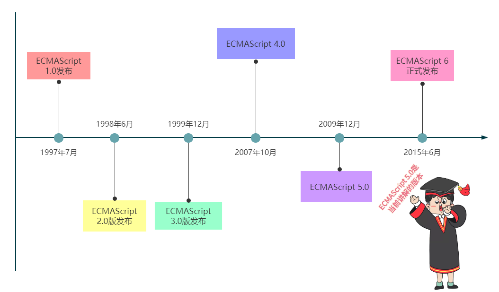


**实时效果反馈**

**1. ECMAScript和JavaScript关系：**

<font style="background-color:rgb(233, 30, 100)">A</font>   JavaScript是ECMAScript的父级

<font style="background-color:rgb(255, 197, 10)">B</font>   JavaScript是ECMAScript的子级

<font style="background-color:#8bc34a">C</font>   不存在ECMAScript这个名字

<font style="background-color:rgb(2, 170, 244);">D</font>   前者是后者的规格，后者是前者的一种实现


**2.  以下哪个不是JavaScript的优点:**

<font style="background-color:rgb(233, 30, 100)">A</font>   JavaScript操控浏览器的能力

<font style="background-color:rgb(255, 197, 10)">B</font>   JavaScript广泛的使用领域

<font style="background-color:#8bc34a">C</font>   JavaScript易学性

<font style="background-color:rgb(2, 170, 244);">D</font>   JavaScript可以实现操作系统


**答案**

1=>D  		2=>D 


## JavaScript语句、标识符


### 语句

JavaScript 程序的单位是行（line），也就是一行一行地执行。一般情况下，每一行就是一个语句

```js
var num = 10;
```

语句以分号结尾，一个分号就表示一个语句结束


### 标识符

标识符（identifier）指的是用来识别各种值的合法名称。最常见的标识符就是变量名

标识符是由：字母、美元符号($)、下划线(_)和数字组成，其中数字不能开头

>**温馨提示**
>
>中文是合法的标识符，可以用作变量名（不推荐）


### JavaScript保留关键字

以下关键字不需要强行记忆！

> JavaScript有一些保留字，不能用作标识符：arguments、break、case、catch、class、const、continue、debugger、default、delete、do、else、enum、eval、export、extends、false、finally、for、function、if、implements、import、in、instanceof、interface、let、new、null、package、private、protected、public、return、static、super、switch、this、throw、true、try、typeof、var、void、while、with、yield。


**实时效果反馈**

**1. 以下哪个命名是正确的：**

<font style="background-color:rgb(233, 30, 100)">A</font>   `var const = 10;`

<font style="background-color:rgb(255, 197, 10)">B</font>   `var 10Num = 20;`

<font style="background-color:#8bc34a">C</font>   `var @A = 30;`

<font style="background-color:rgb(2, 170, 244);">D</font>   `var age=20;`


**2.  以下哪个是标识符命名规则:**

<font style="background-color:rgb(233, 30, 100)">A</font>   字母、美元符号($)、下划线(_)和数字

<font style="background-color:rgb(255, 197, 10)">B</font>   字母、美元符号($)、下划线(_)和数字，其中数字不能开头

<font style="background-color:#8bc34a">C</font>   字母、美元符号($)、百分号(%)和数字，其中数字不能开头

<font style="background-color:rgb(2, 170, 244);">D</font>   字母、美元符号($)、下划线(_)和特殊符号


**答案**

1=>D  		2=>B 


## 变量


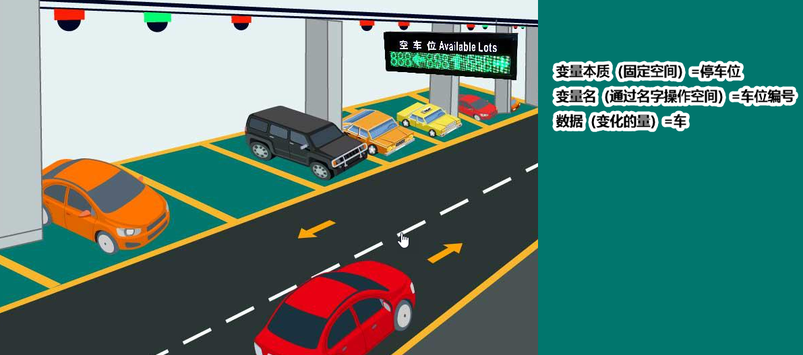


```js
var num = 10; 
```


#### 变量的重新赋值

```js
var num = 10;
num = 20;
```


### 变量提升

JavaScript 引擎的工作方式是，先解析代码，获取所有被声明的变量，然后再一行一行地运行。这造成的结果，就是所有的变量的声明语句，都会被提升到代码的头部，这就叫做变量提升（hoisting）。

```js
console.log(num);
var num = 10; // 结果是什么呢？
```


**实时效果反馈**

**1. 以下代码打印正确的是：**

```js
console.log(num);
var num = 10; 
```

<font style="background-color:rgb(233, 30, 100)">A</font>   10

<font style="background-color:rgb(255, 197, 10)">B</font>   错误

<font style="background-color:#8bc34a">C</font>   undefined

<font style="background-color:rgb(2, 170, 244);">D</font>   num


**答案**

1=>C 


## JavaScript引入到文件


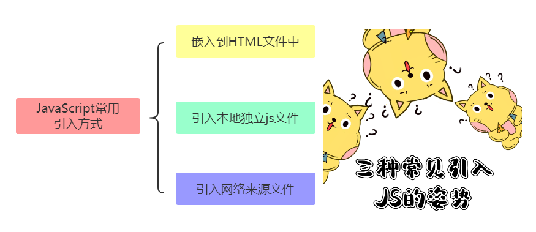


### 嵌入到HTML文件中

```html
<body>
	<script>
		var age = 20
	</script>
</body>
```


### 引入本地独立JS文件

```html
<body>
	<script type="text/javascript" src="./itbaizhan.js">   		</script>
</body>
```


### 引入网络来源文件

```html
<body>
	<script src="https://cdn.bootcdn.net/ajax/libs/jquery/3.6.0/jquery.min.js">	</script>
</body>
```


**实时效果反馈**

**1. 以下哪种不是JS文件引入到HTML文件中的方式：**

<font style="background-color:rgb(233, 30, 100)">A</font>   JS嵌入到HTML文件中

<font style="background-color:rgb(255, 197, 10)">B</font>   引入本地独立JS文件

<font style="background-color:#8bc34a">C</font>   引入网络来源的JS文件

<font style="background-color:rgb(2, 170, 244);">D</font>   JS嵌入到CSS文件中


**2.  以下代码是哪种JS引入到HTML文件中的方式:**

```html
<body>
	<script type="text/javascript" src="./itbaizhan.js">   		</script>
</body>
```

<font style="background-color:rgb(233, 30, 100)">A</font>   JS嵌入到HTML文件中

<font style="background-color:rgb(255, 197, 10)">B</font>   引入本地独立JS文件

<font style="background-color:#8bc34a">C</font>   引入网络来源的JS文件

<font style="background-color:rgb(2, 170, 244);">D</font>   JS嵌入到CSS文件中


**答案**

1=>D  		2=>B 


## JavaScript注释与常见输出方式


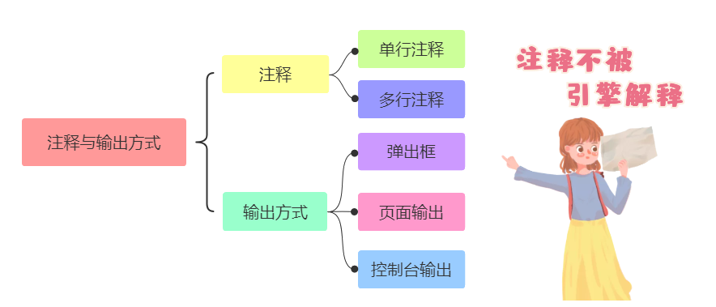


### JavaScript注释

源码中注释是不被引擎所解释的，它的作用是对代码进行解释。Javascript 提供两种注释的写法：一种是单行注释，用//起头；另一种是多行注释，放在/*和*/之间。

```js
// 这是单行注释

/*
 这是
 多行
 注释
*/
```

嵌入在HTML文件中的注释

```html
<!-- 注释 -->
```

> **温馨提示**
>
> 注释的快捷键：`ctrl + /`


### JavaScript输出方式

JavaScript有很多种输出方式，都可以让我们更直观的看到程序运行的结果

```js
// 在浏览器中弹出一个对话框,然后把要输出的内容展示出来,alert都是把要输出的内容首先转换为字符串然后在输出的
alert("要输出的内容");

document.write("要输出的内容"); 

// 在控制台输出内容
console.log("要输出的内容");
```


**实时效果反馈**

**1. 下述代码横线处应填写的代码：**

```js
document.___("要输出的内容"); 
```

<font style="background-color:rgb(233, 30, 100)">A</font>   document

<font style="background-color:rgb(255, 197, 10)">B</font>   alert

<font style="background-color:#8bc34a">C</font>   log

<font style="background-color:rgb(2, 170, 244);">D</font>   write


**2.  下述代码横线处应填写的代码:**

```html
console.___("要输出的内容");
```

<font style="background-color:rgb(233, 30, 100)">A</font>   document

<font style="background-color:rgb(255, 197, 10)">B</font>   alert

<font style="background-color:#8bc34a">C</font>   log

<font style="background-color:rgb(2, 170, 244);">D</font>   write


**答案**

1=>D  		2=>C 


## 数据类型


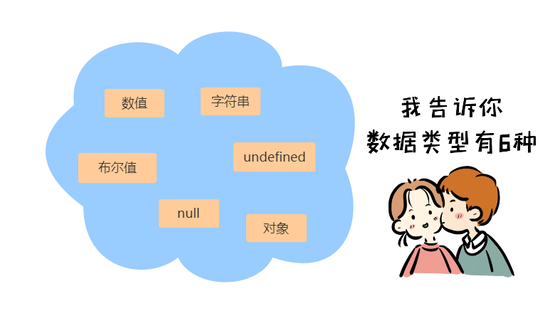


### 数据类型分类

JavaScript 语言的每一个值，都属于某一种数据类型。JavaScript 的数据类型，共有六种。（ES6 又新增了第七种 Symbol 类型的值和第八种 BigInt类型，当前课程暂不涉及）


### 数据类型分类


#### 原始类型(基础类型)


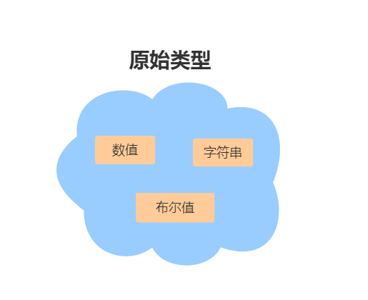


```js
var age = 20;
var name = "尚学堂";
var learn = true;
```


#### 合成类型(复合类型)

对象：因为一个对象往往是多个原始类型的值的合成，可以看作是一个存放各种值的容器

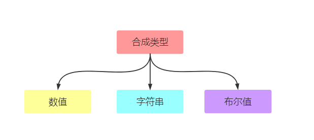


```js
var user = {
    name:"尚学堂",
    age:20,
    learn:true
}
```


> **温馨提示**
>
> 至于undefined和null，一般将它们看成两个特殊值。


**实时效果反馈**

**1. 以下那个是字符串类型数据：**

<font style="background-color:rgb(233, 30, 100)">A</font>   `var age = 20; `

<font style="background-color:rgb(255, 197, 10)">B</font>   `var name = "尚学堂"`

<font style="background-color:#8bc34a">C</font>   `var learn = true`

<font style="background-color:rgb(2, 170, 244);">D</font>   `var user = {}`


**2.  以下关于原始数据类型分类正确的是:**

<font style="background-color:rgb(233, 30, 100)">A</font>   数值、字符串、布尔值、对象

<font style="background-color:rgb(255, 197, 10)">B</font>   数值、字符串、布尔值、null

<font style="background-color:#8bc34a">C</font>   数值、字符串、布尔值、undefined

<font style="background-color:rgb(2, 170, 244);">D</font>   数值、字符串、布尔值


**答案**

1=>B  		2=>D 


## typeof运算符


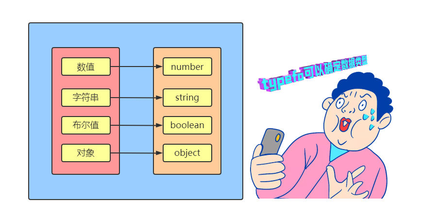


JavaScript 有三种方法，可以确定一个值到底是什么类型。而我们现在需要接触到的就是typeof


### 数值返回number

```js
typeof 123 // "number"
```


### 字符串返回string

```js
typeof '123' // "string"
```


### 布尔值返回boolean

```js
typeof false // "boolean"
```


### 对象返回object

```js
typeof {} // "object"
```


### unll和undefined的区别

null与undefined都可以表示“没有”，含义非常相似。将一个变量赋值为undefined或null，老实说，语法效果几乎没区别。既然含义与用法都差不多，为什么要同时设置两个这样的值，这不是无端增加复杂度，令初学者困扰吗？这与历史原因有关


**实时效果反馈**

**1. 下列字符串数据类型的关键字是：**

<font style="background-color:rgb(233, 30, 100)">A</font>   number

<font style="background-color:rgb(255, 197, 10)">B</font>   string

<font style="background-color:#8bc34a">C</font>   boolean

<font style="background-color:rgb(2, 170, 244);">D</font>   object


**2.  以下代码执行结果正确的是:**

```js
console.log(typeof 100)
```

<font style="background-color:rgb(233, 30, 100)">A</font>   number

<font style="background-color:rgb(255, 197, 10)">B</font>   string

<font style="background-color:#8bc34a">C</font>   boolean

<font style="background-color:rgb(2, 170, 244);">D</font>   object


**答案**

1=>B  		2=>A 


## 运算符之算术运算符


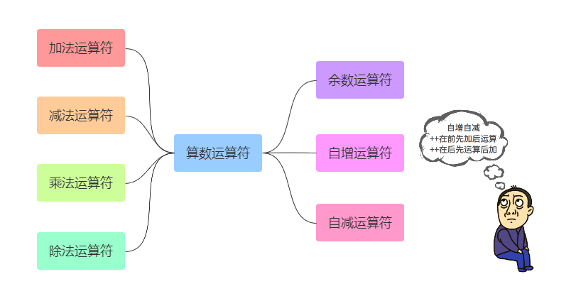


### 加减乘除运算符

加减乘除运算符就是基本的数学运算符效果

```js
10 + 10; // 20
100 - 10; // 90
10 * 2; //20
10 / 5; 2
```


### 余数运算符

余数运算符是比较常用的，因为在逻辑思维上寻找规律，余数运算符是很好用的

```js
13 % 5 // 3
```


### 自增和自减运算符

自增和自减运算符，是一元运算符，只需要一个运算子。它们的作用是将运算子首先转为数值，然后加上1或者减去1

```js
var x = 1;
var y = 1;
++x // 2
--y // 0
```


自增和自减运算符有一个**需要注意**的地方，就是放在变量之后，会先返回变量操作前的值，再进行自增/自减操作；放在变量之前，会先进行自增/自减操作，再返回变量操作后的值。

```js
var x = 1;
var y = 1;

x++ // 1
++y // 2
```

```js
var x = 10;
var y = 20;
console.log(x++ + y);// 30
```


**实时效果反馈**

**1. 下列代码执行结果正确的是：**

```js
var x = 5;
var y = 5;
console.log(x++  +  --y);
```

<font style="background-color:rgb(233, 30, 100)">A</font>   9

<font style="background-color:rgb(255, 197, 10)">B</font>   10

<font style="background-color:#8bc34a">C</font>   11

<font style="background-color:rgb(2, 170, 244);">D</font>   12


**2. 关于自增自减运算符描述正确的是 :**

<font style="background-color:rgb(233, 30, 100)">A</font>   自增和自减运算符，是二元运算符，只需要二个运算子

<font style="background-color:rgb(255, 197, 10)">B</font>   自增和自减运算符，就是加法和减法运算符

<font style="background-color:#8bc34a">C</font>   自增和自减运算符，是一元运算符，只需要一个运算子

<font style="background-color:rgb(2, 170, 244);">D</font>   自增和自减运算符，符号在前或者在后都是一样的


**答案**

1=>A  		2=>C 


## 运算符之赋值运算符


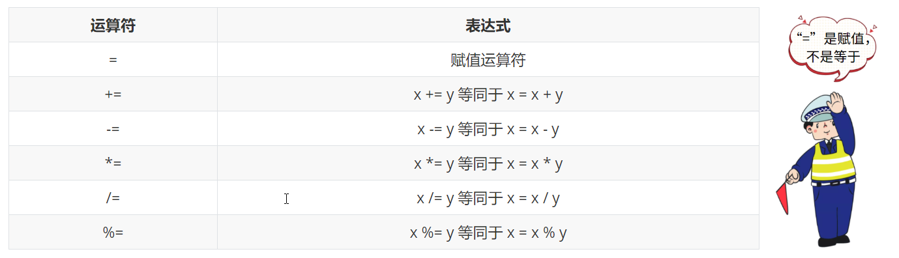


赋值运算符（Assignment Operators）用于给变量赋值

最常见的赋值运算符，当然就是等号（=）

```js
// 将 1 赋值给变量 x
var x = 1;

// 将变量 y 的值赋值给变量 x
var x = y;
```

赋值运算符还可以与其他运算符结合，形成变体。下面是与算术运算符的结合

```js
// 等同于 x = x + y
x += y

// 等同于 x = x - y
x -= y

// 等同于 x = x * y
x *= y

// 等同于 x = x / y
x /= y

// 等同于 x = x % y
x %= y
```


**实时效果反馈**

**1.下列代码的运行结果是 ：**

```js
var num1 = 10;
var num2 = 20;
console.log(num1 += num2);
```

<font style="background-color:rgb(233, 30, 100)">A</font>   10

<font style="background-color:rgb(255, 197, 10)">B</font>   20

<font style="background-color:#8bc34a">C</font>   30

<font style="background-color:rgb(2, 170, 244);">D</font>   40


**2.  下列代码的运行结果是:**

```js
var num1 = 12;
var num2 = num1;		
console.log(++num1 + num2);
```

<font style="background-color:rgb(233, 30, 100)">A</font>   20

<font style="background-color:rgb(255, 197, 10)">B</font>   25

<font style="background-color:#8bc34a">C</font>   30

<font style="background-color:rgb(2, 170, 244);">D</font>   35


**答案**

1=>C  		2=>B 


## 运算符之比较运算符


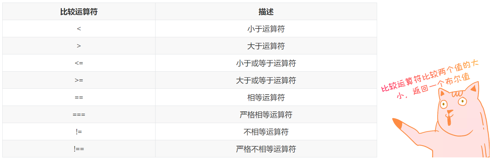


比较运算符用于比较两个值的大小，然后返回一个布尔值，表示是否满足指定的条件。

```js
2 > 1 // true
```

JavaScript 一共提供了8个比较运算符。

| 比较运算符 |       描述       |
| :--------: | :--------------: |
|     <      |    小于运算符    |
|     \>     |    大于运算符    |
|     <=     | 小于或等于运算符 |
|    \>=     | 大于或等于运算符 |
|     ==     |    相等运算符    |
|    ===     |  严格相等运算符  |
|     !=     |   不相等运算符   |
|    !==     | 严格不相等运算符 |


### “==”和“===”的区别

## ==：双等比较值

===：三等比较值和类型


**实时效果反馈**

**1.下列那个选项是比较运算符 ：**

<font style="background-color:rgb(233, 30, 100)">A</font>   `=`

<font style="background-color:rgb(255, 197, 10)">B</font>   `==`

<font style="background-color:#8bc34a">C</font>   `+=`

<font style="background-color:rgb(2, 170, 244);">D</font>   `++`


**2.  下列关于"=="和"==="运算符的描述正确的是:**

<font style="background-color:rgb(233, 30, 100)">A</font>   双等比较值,三等也是比较值

<font style="background-color:rgb(255, 197, 10)">B</font>   双等比较值和类型,三等比较值

<font style="background-color:#8bc34a">C</font>   双等比较值和类型,三等比较值和类型

<font style="background-color:rgb(2, 170, 244);">D</font>   双等比较值,三等比较值和类型


**答案**

1=>B  		2=>D 


## 运算符之布尔运算符


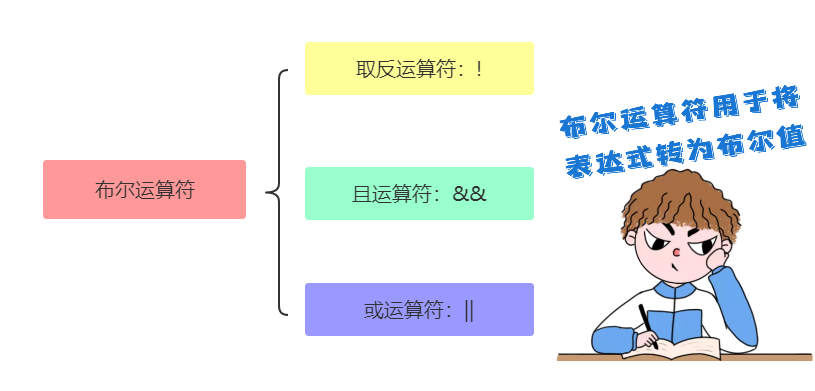


### 取反运算符（!）


#### 布尔值取反

```js
!true // false
!false // true
```


#### 非布尔值取反

对于非布尔值，取反运算符会将其转为布尔值。可以这样记忆，以下六个值取反后为true，其他值都为false。

> **温馨提示**
>
> undefined
> null
> false
> 0
> NaN
> 空字符串（''）


```js
!undefined // true
!null // true
!0 // true
!NaN // true
!"" // true

!54 // false
!'hello' // false
```


### 且运算符（&&）

多个条件都要满足

> 如果一个人一直做好事，突然有一天做了一件坏事，那么人们会认为这个人很虚伪，以前说不定都是装的！对这个人不在认可

```js
console.log(10 < 20 && 10 >5); // true
```


### 或运算符（||）

满足一个条件即可

> 如果一个人一直做坏事，突然有一天做了一件好事，那么人们会认为这个人其实还不错，以前也许是另有原因！对这个人突然就认可了

```js
console.log(10 < 20 || 10 < 5); // true
```


**实时效果反馈**

**1.下列代码运行结果是 ：**

```js
!undefined
!'hello'
```

<font style="background-color:rgb(233, 30, 100)">A</font>   true  true

<font style="background-color:rgb(255, 197, 10)">B</font>   false false

<font style="background-color:#8bc34a">C</font>   true false

<font style="background-color:rgb(2, 170, 244);">D</font>   false true


**2.  下列代码中运行结果是:**

```js
var num = 0;
++num;
console.log(!num);
```

<font style="background-color:rgb(233, 30, 100)">A</font>   0

<font style="background-color:rgb(255, 197, 10)">B</font>   true

<font style="background-color:#8bc34a">C</font>   1

<font style="background-color:rgb(2, 170, 244);">D</font>   false


**答案**

1=>C  		2=>D 


## 条件语句之 if语句


if结构先判断一个表达式的布尔值，然后根据布尔值的真伪，执行不同的语句。所谓布尔值，指的是 JavaScript 的两个特殊值，true表示真，false表示伪。


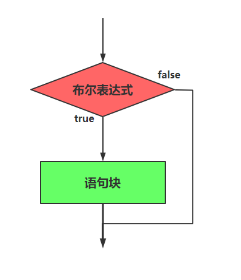


### if语句语法规范

```js
if (布尔值){
   语句; 
}
```


需要注意的是，“布尔值”往往由一个条件表达式产生的，必须放在圆括号中

```js
var m = 3;
if (m === 3) {
    m++;
}
console.log(m); // 4
```


注意，if后面的表达式之中，不要混淆赋值表达式（=）、严格相等运算符（===）和相等运算符（==）。尤其是赋值表达式不具有比较作用。

```js
var x = 1;
var y = 2;
if (x = y) {
    console.log(x);
}
```


**实时效果反馈**

**1.下列条件语句中，横线处应填写代码是 ：**

```js
var zhangsan = 34;
var lisi = 30;
if(zhangsan ___ lisi){
    console.log("张三更大"); // 张三更大
}
```

<font style="background-color:rgb(233, 30, 100)">A</font>   <

<font style="background-color:rgb(255, 197, 10)">B</font>   =

<font style="background-color:#8bc34a">C</font>   ==

<font style="background-color:rgb(2, 170, 244);">D</font>   >


**2. 下列代码运行结果是:**

```js
var num1 = "10"
var num2 = 10;
if(num1 ___ num2){
    console.log("num1等于num2"); // 无打印
}
```

<font style="background-color:rgb(233, 30, 100)">A</font>   >=

<font style="background-color:rgb(255, 197, 10)">B</font>   =

<font style="background-color:#8bc34a">C</font>   ==

<font style="background-color:rgb(2, 170, 244);">D</font>   ===


**答案**

1=>D  		2=>D


## 条件语句之 if...else


### if...else基本结构

if代码块后面，还可以跟一个else代码块，表示不满足条件时，所要执行的代码。

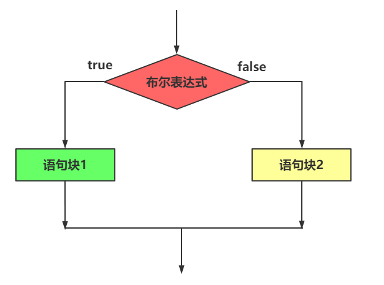

```js
if (m === 3) {
  // 满足条件时，执行的语句
} else {
  // 不满足条件时，执行的语句
}
```


### 多个if...else连接

对同一个变量进行多次判断时，多个if...else语句可以连写在一起。

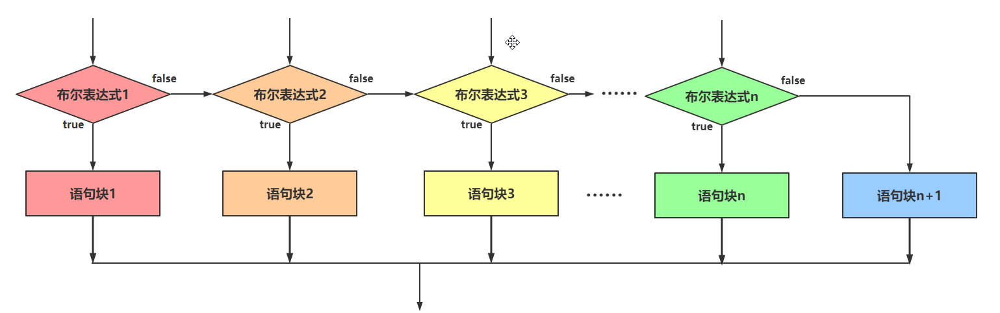

```js
if (m === 0) {
  // ...
} else if (m === 1) {
  // ...
} else if (m === 2) {
  // ...
} else {
  // ...
}
```


### if...else嵌套

```js
var eat = true;
var food = "猪肉炖粉条";
if (eat) {
    if (food == "双椒鱼头") {
        console.log('双椒鱼头');	
    }else{
        console.log("猪肉炖粉条");
    }
} else {
    console.log('不吃了');
}
```

else代码块总是与离自己最近的那个if语句配对。


**实时效果反馈**

**1.下列条件语句中，横线处应填写代码是 ：**

```js
var eat = true;
var food = "猪肉炖粉条";
if (eat) {
    if (food ___ "双椒鱼头") {    
        console.log('双椒鱼头'); // 打印双椒鱼头
    }else{
        console.log("猪肉炖粉条");  
    }
} else {
    console.log('不吃了');
}
```

<font style="background-color:rgb(233, 30, 100)">A</font>   =

<font style="background-color:rgb(255, 197, 10)">B</font>   ==

<font style="background-color:#8bc34a">C</font>   ===

<font style="background-color:rgb(2, 170, 244);">D</font>   !=


**2. 下列代码运行结果是:**

```js
var day = 3;
if(day === 1){
    console.log("再向虎山行");
}else if(day === 2){
    console.log("路漫漫");
}else if(day === 3){
    console.log("野茫茫");
}else if(day === 4){
    console.log("曙光在前头");
}else if(day === 5){
    console.log("归心似箭");
}else{
    console.log("胜利大逃亡");
}
```

<font style="background-color:rgb(233, 30, 100)">A</font>   再向虎山行

<font style="background-color:rgb(255, 197, 10)">B</font>   野茫茫

<font style="background-color:#8bc34a">C</font>   曙光在前头

<font style="background-color:rgb(2, 170, 244);">D</font>   胜利大逃亡


**答案**

1=>D  		2=>B


## 条件语句之 switch


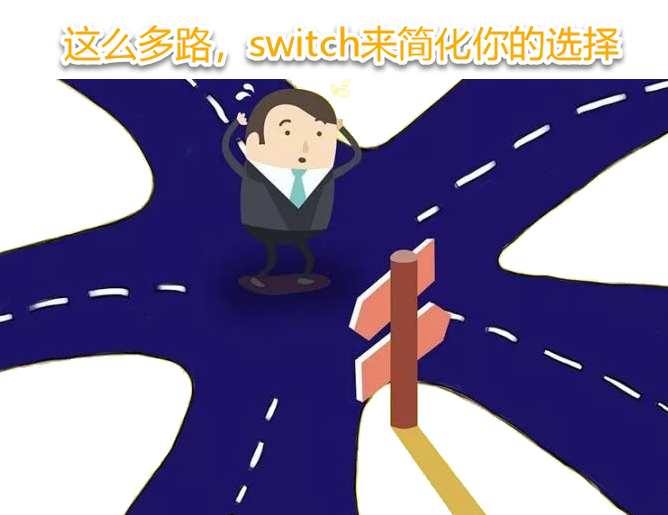


多个if...else连在一起使用的时候，可以转为使用更方便的switch结构

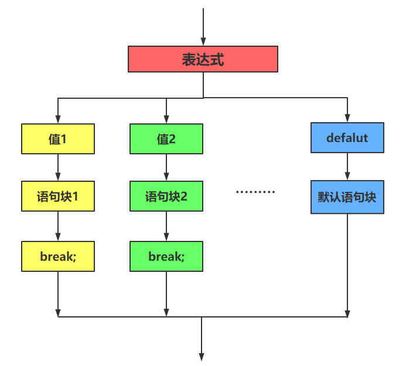

```js
switch (fruit) {
  case "banana":
    // ...
    break;
  case "apple":
    // ...
    break;
  default:
    // ...
}
```

需要注意的是，每个case代码块内部的break语句不能少，否则会接下去执行下一个case代码块，而不是跳出switch结构。

```js
var x = 1;

switch (x) {
  case 1:
    console.log('x 等于1');
  case 2:
    console.log('x 等于2');
  default:
    console.log('x 等于其他值');
}
// x等于1
// x等于2
// x等于其他值
```


**实时效果反馈**

**1.下列swtich语句中，横线处应填写代码是 ：**

```js
var x = 4;
switch (x) {
    case 1:
        console.log('x 等于1');
        break
    case 2:
        console.log('x 等于2');
        ____
    default:
        console.log('x 等于其他值'); // 打印x等于其他值
}
```

<font style="background-color:rgb(233, 30, 100)">A</font>   swtich

<font style="background-color:rgb(255, 197, 10)">B</font>   case

<font style="background-color:#8bc34a">C</font>   break

<font style="background-color:rgb(2, 170, 244);">D</font>   default


**2. 下列代码运行结果是:**

```js
var x = 2;
switch (x) {
    case 1:
        console.log('x 等于1');
    case 2:
        console.log('x 等于2');
    default:
        console.log('x 等于其他值');
}
```

<font style="background-color:rgb(233, 30, 100)">A</font>    x 等于1     x 等于2     x 等于其他值

<font style="background-color:rgb(255, 197, 10)">B</font>    x 等于1     x 等于2     

<font style="background-color:#8bc34a">C</font>    x 等于2     x 等于其他值

<font style="background-color:rgb(2, 170, 244);">D</font>    x 等于1     x 等于其他值


**答案**

1=>C  		2=>C


## 三元运算符 


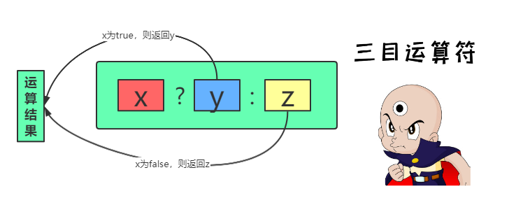


JavaScript还有一个三元运算符（即该运算符需要三个运算子）`?:`，也可以用于逻辑判断。

```js
(条件) ? 表达式1 : 表达式2
```

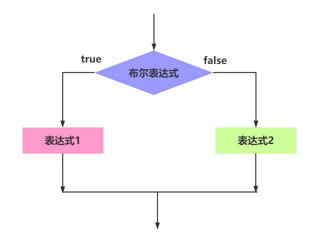

这个三元运算符可以被视为if...else...的简写形式，因此可以用于多种场合。


### 判断一个整数是奇数与偶数

#### if...else语句

```js
var n = 100;
if (n % 2 === 0) {
  console.log("偶数");
} else {
  console.log("奇数");
}
```

#### 三元运算符

```js
var n = 100;
n % 2 === 0 ? '偶数' : '奇数'
```


**实时效果反馈**

**1.以下代码是三元运算符，横线处应该填写 ：**

```js
n % 2 === 0 ___ '偶数' ___ '奇数'
```

<font style="background-color:rgb(233, 30, 100)">A</font>   &&    ||

<font style="background-color:rgb(255, 197, 10)">B</font>   ?     :

<font style="background-color:#8bc34a">C</font>   >=   <=

<font style="background-color:rgb(2, 170, 244);">D</font>   ==  ===


**2.  下列关于三元运算符表达式描述正确的是:**

<font style="background-color:rgb(233, 30, 100)">A</font>   `if(条件){}else{}`

<font style="background-color:rgb(255, 197, 10)">B</font>   `switch(条件){}`

<font style="background-color:#8bc34a">C</font>   `if(条件){}`

<font style="background-color:rgb(2, 170, 244);">D</font>   `(条件) ? 表达式1 : 表达式2`


**答案**

1=>B  		2=>D


## 循环语句之for


循环语句用于重复执行某个操作

for语句就是循环命令，可以指定循环的起点、终点和终止条件。它的格式如下

```js
for (初始化表达式; 条件; 迭代因子) {
  语句
}
```


for语句后面的括号里面，有三个表达式。

1. 初始化表达式（initialize）：确定循环变量的初始值，只在循环开始时执行一次。

2. 布尔表达式（test）：每轮循环开始时，都要执行这个条件表达式，只有值为真，才继续进行循环。

3. 迭代因子（increment）：每轮循环的最后一个操作，通常用来递增循环变量。

   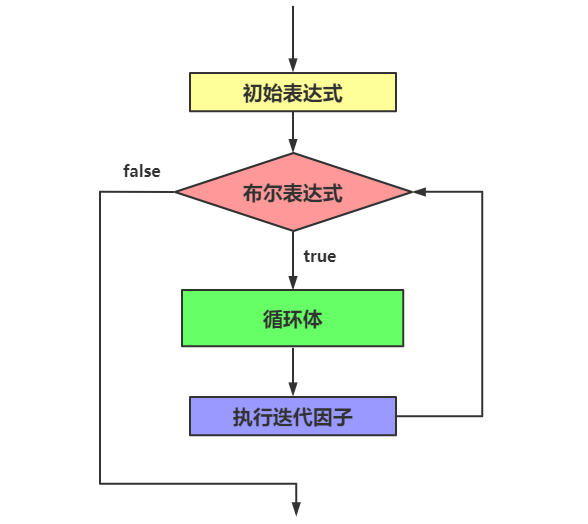

   

```js
var x = 3;
for (var i = 0; i < x; i++) {
  console.log(i);
}
```


for语句的三个表达式，可以省略任何一个，也可以全部省略。

```js
for ( ; ; ){
  console.log('Hello World');
}
```

> **温馨提示**
>
> 如果三个都省略，结果就导致了一个无限循环（死循环）


**实时效果反馈**

**1.以下代码是一个循环语句，横线处应该填写 ：**

```js
var x = 3;
for (var i = 0; i __ x; i__) {
  console.log(i);  // 输出:0，1，2
}
```

<font style="background-color:rgb(233, 30, 100)">A</font>   ==    ++

<font style="background-color:rgb(255, 197, 10)">B</font>   <      ++

<font style="background-color:#8bc34a">C</font>   >      ++     

<font style="background-color:rgb(2, 170, 244);">D</font>   <     ==


**2.  下列关于循环语句描述错误的是:**

<font style="background-color:rgb(233, 30, 100)">A</font>   初始化表达式：确定循环变量的初始值，只在循环开始时执行一次。

<font style="background-color:rgb(255, 197, 10)">B</font>   布尔表达式：每轮循环开始时，都要执行条件表达式，只有值为真，才继续进行循环

<font style="background-color:#8bc34a">C</font>   迭代因子：每轮循环的最后一个操作，通常用来递增循环变量

<font style="background-color:rgb(2, 170, 244);">D</font>   三个表达式全部省略，不会出现无限循环（死循环）


**答案**

1=>B  		2=>D


## for循环语句实操


### 循环输出1~100之间数字的和

```js
var sum=0;
for(var i=1;i<=100;i++){
    sum+=i;
}
console.log(sum);
```


### 循环输出1000以内的奇数

```js
for(i = 0 ; i<1000; i ++){
    if( i % 2 ==1){
        console.log( i + " ");   
    }
}
```


### 打印九九乘法表


```js
for(var i = 1;i <= 9;i++){
    document.write("<br>"); 
    for(var j = 1;j <= i;j++){
        sum = i * j;
        document.write(i ,"*",j ,"=",sum," ");
    }
}
```


## 循环语句之while


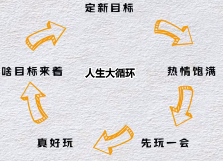


While语句包括一个循环条件和一段代码块，只要条件为真，就不断循环执行代码块。


```js
while (条件) {
  语句;
}
```


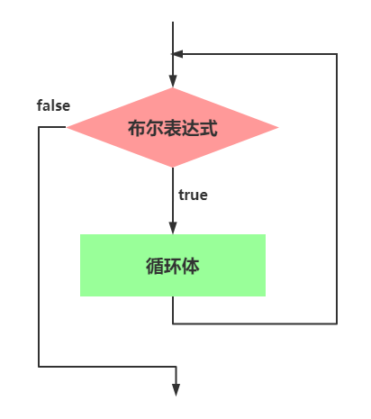


### while例子

```js
var i = 0;
while (i < 100) {
  console.log('i 当前为：' + i);
  i = i + 1;
}
```

下面的例子是一个无限循环，因为循环条件总是为真

```js
while (true) {
  console.log('Hello, world');
}
```

所有for循环，都可以改写成while循环

```js
// for
var x = 3;
for (var i = 0; i < x; i++) {
  console.log(i);
}

// while
var x = 3;
var i = 0;
while (i < x) {
  console.log(i);
  i++;
}
```


**实时效果反馈**

**1.以下代码是一个循环语句，横线处应该填写 ：**

```js
var i = 0;
while (i ___ 100) {
  console.log('i 当前为：' + i);  // 结束输出到100
  i = i + 1;
}
```

<font style="background-color:rgb(233, 30, 100)">A</font>   <

<font style="background-color:rgb(255, 197, 10)">B</font>   <=

<font style="background-color:#8bc34a">C</font>   >

<font style="background-color:rgb(2, 170, 244);">D</font>   >=


**2.  下列代码，运行结果是 ：**

```js
while (true) {
  console.log('Hello, world');
}
```

<font style="background-color:rgb(233, 30, 100)">A</font>   输出一次"Hello, world"

<font style="background-color:rgb(255, 197, 10)">B</font>   没有任何输出

<font style="background-color:#8bc34a">C</font>   无限次输出"Hello, world"(死循环)

<font style="background-color:rgb(2, 170, 244);">D</font>   输出两次"Hello, world"


**答案**

1=>B  		2=>C


## break 语句和 continue 语句


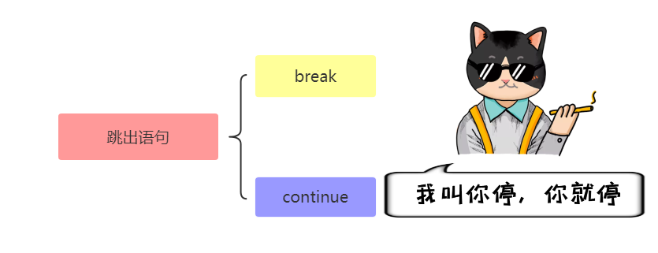


break语句和continue语句都具有跳转作用，可以让代码不按既有的顺序执行


### break

break语句用于跳出代码块或循环

```js
for (var i = 0; i < 5; i++) {
    if (i === 3){
        break;
    }
    console.log(i);
}
```


### continue

continue语句用于立即终止本轮循环，返回循环结构的头部，开始下一轮循环

```js
for (var i = 0; i < 5; i++) {
    if (i === 3){
        continue;
    }
    console.log(i);
}
```


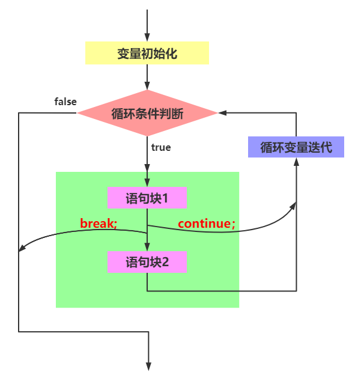


**实时效果反馈**

**1.break和continue的区别 ：**

<font style="background-color:rgb(233, 30, 100)">A</font>   break和continue一样，都是跳出本次循环，进行下次循环

<font style="background-color:rgb(255, 197, 10)">B</font>   break跳出本次循环，进入下次循环，continue跳出整个循环

<font style="background-color:#8bc34a">C</font>   break跳出整个循环，continue跳出本次循环，进入下次循环

<font style="background-color:rgb(2, 170, 244);">D</font>   break和continue一样，跳出全部循环


**2.  以下代码，横线处应该填写的内容是：**

```js
for (var i = 0; i < 5; i++) {
    if (i === 3){
        ___;
    }
    console.log(i); // 输出:0,1,2,4
}
```

<font style="background-color:rgb(233, 30, 100)">A</font>   i++

<font style="background-color:rgb(255, 197, 10)">B</font>   i--

<font style="background-color:#8bc34a">C</font>   break

<font style="background-color:rgb(2, 170, 244);">D</font>   continue


**答案**

1=>C  		2=>D


## 字符串


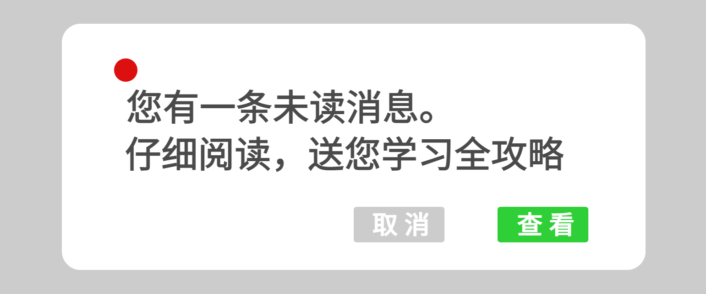


字符串就是零个或多个排在一起的字符，放在单引号或双引号之中

```js
'itbaizhan'
"itbaizhan"
```

单引号字符串的内部，可以使用双引号。双引号字符串的内部，可以使用单引号

```js
'key = "value"'
"It's a long itbaizhan"
```

如果要在单引号字符串的内部，使用单引号，就必须在内部的单引号前面加上反斜杠，用来转义。双引号字符串内部使用双引号，也是如此

```js
'Did she say \'Hello\'?'
// "Did she say 'Hello'?"

"Did she say \"Hello\"?"
// "Did she say "Hello"?"
```

> **温馨提示**
>
> 字符串默认只能写在一行内，分成多行将会报错

如果长字符串必须分成多行，可以在每一行的尾部使用反斜杠

```js
var longString = 'Long \
long \
string';
longString
// "Long long long string"
```


### length 属性

length属性返回字符串的长度，该属性也是无法改变的

```js
var s = 'itbaizhan';
s.length // 9
```


**实时效果反馈**

**1. 下列字符串，横线处应该填写的代码是：**

```js
"Did she say ___"Hello___"?"
```

<font style="background-color:rgb(233, 30, 100)">A</font>   ""   ''

<font style="background-color:rgb(255, 197, 10)">B</font>   ''    ""

<font style="background-color:#8bc34a">C</font>   \   \

<font style="background-color:rgb(2, 170, 244);">D</font>  ""  ""


**答案**

1=>C   


## 字符串方法_charAt()


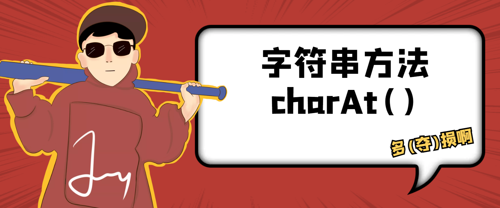


`charAt`方法返回指定位置的字符，参数是从`0`开始编号的

```js
var s = new String('itbaizhan');

s.charAt(1) // "t"
s.charAt(s.length - 1) // "n"
```


如果参数为负数，或大于等于字符串的长度，`charAt`返回空字符串

```js
'itbaizhan'.charAt(-1) // ""
'itbaizhan'.charAt(9) // ""
```


**实时效果反馈**

**1. 下列字符串方法charAt的应用，代码输出结果是：**

```js
'itbaizhan'.charAt(9);
```

<font style="background-color:rgb(233, 30, 100)">A</font>   o

<font style="background-color:rgb(255, 197, 10)">B</font>   0

<font style="background-color:#8bc34a">C</font>   hello

<font style="background-color:rgb(2, 170, 244);">D</font>  ""


**答案**

1=>D  


## 字符串方法_concat()


`concat`方法用于连接两个字符串，返回一个新字符串，不改变原字符串

```js
var s1 = 'itbaizhan';
var s2 = 'sxt';

s1.concat(s2) // "itbaizhansxt"
s1 // "itbaizhan"
```

该方法可以接受多个参数

```js
'sxt'.concat('itbaizhan', 'bjsxt') // "sxtitbaizhanbjsxt"
```

如果参数不是字符串，`concat`方法会将其先转为字符串，然后再连接

```js
var one = 1;
var two = 2;
var three = '3';

''.concat(one, two, three) // "123"
```


**实时效果反馈**

**1. 下列字符串方法concat的应用，代码输出结果是：**

```js
var one = 1;
var two = 2;
var three = '3';

console.log(''.concat(one, two, three) )
console.log(one + two + three )
```

<font style="background-color:rgb(233, 30, 100)">A</font>   123    33

<font style="background-color:rgb(255, 197, 10)">B</font>   123    123

<font style="background-color:#8bc34a">C</font>   33      33

<font style="background-color:rgb(2, 170, 244);">D</font>   6       6


**答案**

1=>A  


## 字符串方法_substring()


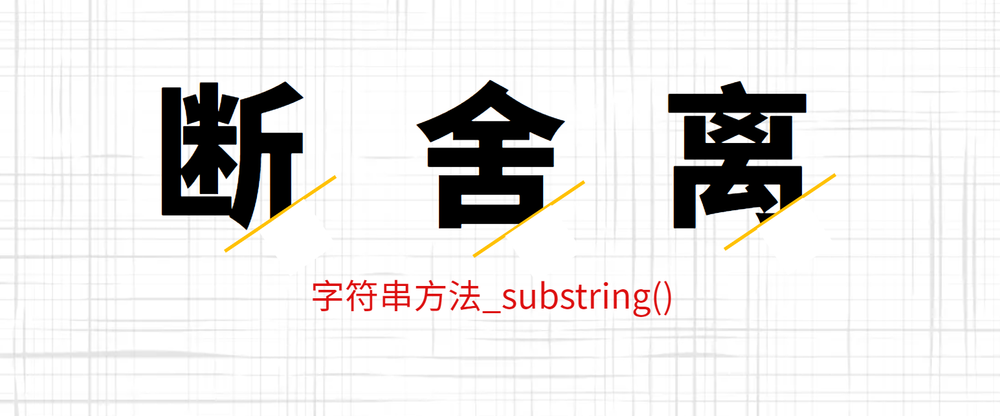


`substring`方法用于从原字符串取出子字符串并返回，不改变原字符串。它的第一个参数表示子字符串的开始位置，第二个位置表示结束位置（返回结果不含该位置）

```js
'itbaizhan'.substring(0, 2) // "it"
```

如果省略第二个参数，则表示子字符串一直到原字符串的结束

```js
'itbaizhan'.substring(2) // "baizhan"
```

如果第一个参数大于第二个参数，`substring`方法会自动更换两个参数的位置

```js
'itbaizhan'.substring(9, 2) // "baizhan"
// 等同于
'itbaizhan'.substring(2, 9) // "baizhan"
```

如果参数是负数，`substring`方法会自动将负数转为0

```
'itbaizhan'.substring(-3) // "itbaizhan"
'itbaizhan'.substring(2, -3) // "it"
```


**实时效果反馈**

**1. 下列字符串方法substring的应用，代码输出结果是：**

```js
'itbaizhan'.substring(5, -3)
```

<font style="background-color:rgb(233, 30, 100)">A</font>   ""

<font style="background-color:rgb(255, 197, 10)">B</font>   itbaizhan

<font style="background-color:#8bc34a">C</font>   itbai

<font style="background-color:rgb(2, 170, 244);">D</font>   bai


**答案**

1=>C  


## 字符串方法_substr()


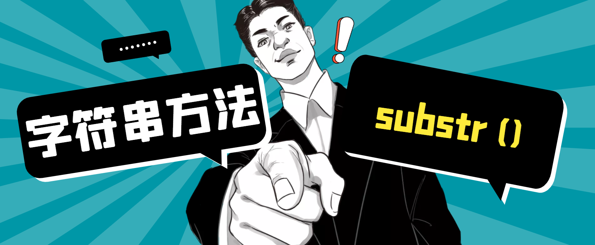


`substr`方法用于从原字符串取出子字符串并返回，不改变原字符串，跟`substring`方法的作用相同

`substr`方法的第一个参数是子字符串的开始位置（从0开始计算），第二个参数是子字符串的长度

```js
'itbaizhan'.substr(2, 7); // baizhan
```

如果省略第二个参数，则表示子字符串一直到原字符串的结束

```js
'itbaizhan'.substr(2) // "baizhan"
```

如果第一个参数是负数，表示倒数计算的字符位置。如果第二个参数是负数，将被自动转为0，因此会返回空字符串

```js
'itbaizhan'.substr(-7) // "baizhan"
'itbaizhan'.substr(4, -1) // ""
```


**实时效果反馈**

**1. 下列字符串方法substr的应用，代码输出结果是：**

```js
'itbaizhan'.substr(2, -2)
```

<font style="background-color:rgb(233, 30, 100)">A</font>   ""

<font style="background-color:rgb(255, 197, 10)">B</font>   itbaizhan

<font style="background-color:#8bc34a">C</font>   itbai

<font style="background-color:rgb(2, 170, 244);">D</font>   bai


**答案**

1=>A 


## 字符串方法_indexOf()


`indexOf`方法用于确定一个字符串在另一个字符串中第一次出现的位置，返回结果是匹配开始的位置。如果返回`-1`，就表示不匹配

```js
'hello world'.indexOf('o') // 4
'itbaizhan'.indexOf('sxt') // -1
```

`indexOf`方法还可以接受第二个参数，表示从该位置开始向后匹配

```js
'hello world'.indexOf('o', 6) // 7
```


**实时效果反馈**

**1. 下列字符串方法indexOf的应用，代码输出结果是：**

```js
'itbaizhan'.indexOf("z",6)
```

<font style="background-color:rgb(233, 30, 100)">A</font>   -1

<font style="background-color:rgb(255, 197, 10)">B</font>   itbaizhan

<font style="background-color:#8bc34a">C</font>   0

<font style="background-color:rgb(2, 170, 244);">D</font>   5


**答案**

1=>A 


## 字符串方法_trim()


`trim`方法用于去除字符串两端的空格，返回一个新字符串，不改变原字符串

```js
'  hello world  '.trim()
// "hello world"
```

该方法去除的不仅是空格，还包括制表符（`\t`、`\v`）、换行符（`\n`）和回车符（`\r`）

```js
'\r\nitbaizhan \t'.trim() // 'itbaizhan'
```

ES6扩展方法，`trimEnd()`和`trimStart()`方法

```js
"   itbaizhan   ".trimEnd(); //    itbaizhan
"   itbaizhan   ".trimStart(); // itbaizhan   
```


**实时效果反馈**

**1. 下列字符串方法trim的应用，代码输出结果是：**

```js
'\r\n itbaizhan \t  '.trim()
```

<font style="background-color:rgb(233, 30, 100)">A</font>   \r\n itbaizhan \t

<font style="background-color:rgb(255, 197, 10)">B</font>   \r\nitbaizhan\t

<font style="background-color:#8bc34a">C</font>   \r\nitbaizhan  \t

<font style="background-color:rgb(2, 170, 244);">D</font>   itbaizhan


**答案**

1=>D 


## 字符串方法_split()


`split`方法按照给定规则分割字符串，返回一个由分割出来的子字符串组成的数组

```js
'it|sxt|baizhan'.split('|') // ["it", "sxt", "baizhan"]
```

如果分割规则为空字符串，则返回数组的成员是原字符串的每一个字符。

```js
'a|b|c'.split('') // ["a", "|",  "b","|", "c"]
```

如果省略参数，则返回数组的唯一成员就是原字符串

```js
'it|sxt|bz'.split() // [it|sxt|bz]
```

`split`方法还可以接受第二个参数，限定返回数组的最大成员数。

```js
'it|sxt|bz'.split('|', 0) // []
'it|sxt|bz'.split('|', 1) // ["it"]
'it|sxt|bz'.split('|', 2) // ["it", "sxt"]
'it|sxt|bz'.split('|', 3) // ["it", "sxt", "bz"]
'it|sxt|bz'.split('|', 4) // ["it", "sxt", "bz"]
```


**实时效果反馈**

**1. 下列字符串操作代码，执行结果是：**

```js
"itbaizhan".split("");
```

<font style="background-color:rgb(233, 30, 100)">A</font>   `[itbaizhan]`

<font style="background-color:rgb(255, 197, 10)">B</font>   `['it','haizhan']`

<font style="background-color:#8bc34a">C</font>   `['i', 't', 'b', 'a', 'i', 'z', 'h', 'a', 'n']`

<font style="background-color:rgb(2, 170, 244);">D</font>   `'i', 't', 'b', 'a', 'i', 'z', 'h', 'a', 'n'`


**答案**

1=>C 


## 数组


数组（array）是按次序排列的一组值。每个值的位置都有编号（从0开始），整个数组用方括号表示。

```js
var arr = ['sxt', 'baizhan', 'it'];
```

两端的方括号是数组的标志。`sxt`是0号位置，`baizhan`是1号位置，`it`是2号位置。（位置也被称为下标）


除了在定义时赋值，数组也可以先定义后赋值。

```js
var arr = [];

arr[0] = 'sxt';
arr[1] = 'baizhan';
arr[2] = 'it';
```

任何类型的数据，都可以放入数组

```js
var arr = [ 100, [1, 2, 3],false ];
```

如果数组的元素还是数组，就形成了多维数组

```js
var a = [[1, 2], [3, 4]];
a[0][1] // 2
a[1][1] // 4
```


### length 属性

数组的length属性，返回数组的成员数量

```js
['sxt', 'baizhan', 'it'].length // 3
```


**实时效果反馈**

**1. 下列关于数组的操作，输出结果是：**

```js
var arr = [ 'sxt', 'baizhan', 'it' ];
console.log(arr[5])
```

<font style="background-color:rgb(233, 30, 100)">A</font>   0

<font style="background-color:rgb(255, 197, 10)">B</font>   []

<font style="background-color:#8bc34a">C</font>   undefined

<font style="background-color:rgb(2, 170, 244);">D</font>   ""


**答案**

1=>C


## 数组的遍历


数组的遍历可以考虑使用for循环或while循环

```js
var a = ['sxt', 'baizhan', 'it'];

// for循环
for(var i = 0; i < a.length; i++) {
  console.log(a[i]);
}

// while循环
var i = 0;
while (i < a.length) {
  console.log(a[i]);
  i++;
}
```

for...in遍历数组

```js
var a = ['sxt', 'baizhan', 'it'];

for (var i in a) {
  console.log(a[i]);
}
```


**实时效果反馈**

**1. 下列遍历数组的操作中，画横线的地方应该填写的代码是：**

```js
var arr = ["尚学堂", 100, true];
for (var i = 0; i < ___; i++) {
    console.log(arr[i]);
}
```

<font style="background-color:rgb(233, 30, 100)">A</font>   arr

<font style="background-color:rgb(255, 197, 10)">B</font>   10

<font style="background-color:#8bc34a">C</font>   length

<font style="background-color:rgb(2, 170, 244);">D</font>   arr.length


**答案**

1=>D


## 数组静态方法_Array.isArray()


`Array.isArray`方法返回一个布尔值，表示参数是否为数组。它可以弥补`typeof`运算符的不足

```js
var arr = ["尚学堂", 100, true];
console.log(typeof arr); // object
```


```js
var arr = ['sxt', 'baizhan', 'it'];
Array.isArray(arr) // true
```


**实时效果反馈**

**1. 下列代码输出分别是？：**

```js
var arr = ["尚学堂", 100, true];
var str = "itbaizhan";
console.log(typeof arr);
console.log(Array.isArray(arr));
console.log(typeof str);
console.log(Array.isArray(str));
```

<font style="background-color:rgb(233, 30, 100)">A</font>   object  false  string  false

<font style="background-color:rgb(255, 197, 10)">B</font>   object  true  string  true

<font style="background-color:#8bc34a">C</font>   object  true  false false

<font style="background-color:rgb(2, 170, 244);">D</font>   object  true  string  false


**答案**

1=>D


## 数组方法_push()/pop()


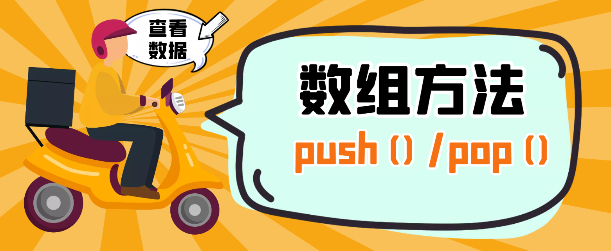


`push`方法用于在数组的末端添加一个或多个元素，并返回添加新元素后的数组长度。注意，该方法会改变原数组

```js
var arr = [];
arr.push("尚学堂") // 1
arr.push('itbaizhan') // 2
arr.push(true, {}) // 4
arr // [尚学堂, 'itbaizhan', true, {}]
```

`pop`方法用于删除数组的最后一个元素，并返回该元素。注意，该方法会改变原数组

```js
var arr = ['尚学堂', 'itbaizhan', 'WEB前端'];

arr.pop() // 'WEB前端'
arr // ['尚学堂', 'itbaizhan']
```


**实时效果反馈**

**1. 下列关于数组输出的结果是：**

```js
var arr = [];
arr.push('尚学堂', 'itbaizhan');
arr.push('WEB前端');
arr.pop();
arr.push('尚学堂');
console.log(arr);
```

<font style="background-color:rgb(233, 30, 100)">A</font>   `['尚学堂', 'itbaizhan', '尚学堂']`

<font style="background-color:rgb(255, 197, 10)">B</font>   `['尚学堂', 'itbaizhan', 'WEB前端']`

<font style="background-color:#8bc34a">C</font>   `['尚学堂', 'itbaizhan']`

<font style="background-color:rgb(2, 170, 244);">D</font>   `['尚学堂', 'WEB前端']`


**答案**

1=>A


## 数组方法_shift()/unshift()


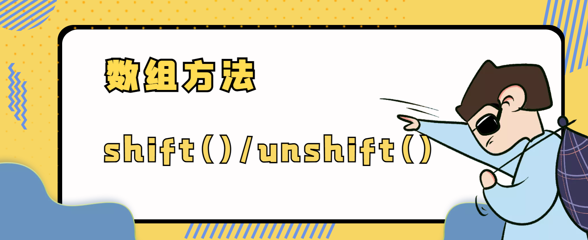


`shift`方法用于删除数组的第一个元素，并返回该元素。注意，该方法会改变原数组

```js
var arr = ['尚学堂', 'itbaizhan', 'WEB前端'];

arr.shift() // '尚学堂'
arr // ['itbaizhan', 'WEB前端']
```

`shift`方法可以遍历并清空一个数组

```js
var list = [1, 2, 3, 4, 5, 6];
var item;

while (item = list.shift()) {
  console.log(item);
}

list // []
```

`unshift`方法用于在数组的第一个位置添加元素，并返回添加新元素后的数组长度。注意，该方法会改变原数组

```js
var arr = ['尚学堂', 'itbaizhan', 'WEB前端'];

arr.unshift('baizhan'); // 4
arr // ['baizhan', '尚学堂', 'itbaizhan', 'WEB前端']
```

`unshift`方法可以接受多个参数，这些参数都会添加到目标数组头部

```js
var arr = [ '尚学堂', 'itbaizhan' ];
arr.unshift('WEB前端', 'baizhan') // 4
arr // [ 'WEB前端', 'baizhan', '尚学堂', 'itbaizhan' ]
```


**实时效果反馈**

**1. 下列关于数组输出的结果是：**

```js
var arr = [];
arr.unshift('尚学堂', 'itbaizhan');
arr.unshift('WEB前端');
arr.shift();
arr.unshift('尚学堂');
console.log(arr);
```

<font style="background-color:rgb(233, 30, 100)">A</font>   `['尚学堂', '尚学堂', 'itbaizhan']`

<font style="background-color:rgb(255, 197, 10)">B</font>   `['尚学堂', 'itbaizhan', 'WEB前端']`

<font style="background-color:#8bc34a">C</font>   `['尚学堂', 'itbaizhan']`

<font style="background-color:rgb(2, 170, 244);">D</font>   `['尚学堂', 'WEB前端']`


**答案**

1=>A


## 数组方法_join()


`join`方法以指定参数作为分隔符，将所有数组成员连接为一个字符串返回。如果不提供参数，默认用逗号分隔

```js
var a = [1, 2, 3, 4];

a.join(' ') // '1 2 3 4'
a.join(' | ') // "1 | 2 | 3 | 4"
a.join() // "1,2,3,4"
```

如果数组成员是`undefined`或`null`或空位，会被转成空字符串

```js
[undefined, null].join('#')
// '#'

['a',, 'b'].join('-')
// 'a--b'
```

数组的`join`配合字符串的`split`可以实现数组与字符串的互换

```js
var arr = ["a","b","c"];
var myArr = arr.join("");
console.log(myArr);
console.log(myArr.split(""));
```


**实时效果反馈**

**1. 下列关于数组输出的结果是：**

```js
var arr = ["尚学堂","百战程序员"];
var myArr = arr.join("");
console.log(myArr);
console.log(myArr.split(""));
```

<font style="background-color:rgb(233, 30, 100)">A</font>   尚学堂百战程序员    ["尚学堂","百战程序员"]

<font style="background-color:rgb(255, 197, 10)">B</font>   尚学堂百战程序员   ['尚', '学', '堂', '百', '战', '程', '序', '员']

<font style="background-color:#8bc34a">C</font>   ["尚学堂","百战程序员"]    尚学堂百战程序员 

<font style="background-color:rgb(2, 170, 244);">D</font>   ['尚', '学', '堂', '百', '战', '程', '序', '员']    尚学堂百战程序员


**答案**

1=>B


## 数组方法_concat()


`concat`方法用于多个数组的合并。它将新数组的成员，添加到原数组成员的后部，然后返回一个新数组，原数组不变

```js
['hello'].concat(['world'])
// ["hello", "world"]

['hello'].concat(['world'], ['!'])
// ["hello", "world", "!"]
```

除了数组作为参数，`concat`也接受其他类型的值作为参数，添加到目标数组尾部。

```js
[1, 2, 3].concat(4, 5, 6)
// [1, 2, 3, 4, 5, 6]
```

> **应用场景**
>
> 上拉加载，合并数据


**实时效果反馈**

**1. 下列关于数组输出的结果是：**

```js
[1, 2, 3].concat(4, 5, 6,[7,8,9])
```

<font style="background-color:rgb(233, 30, 100)">A</font>   ` [1, 2, 3, 4, 5, 6]`

<font style="background-color:rgb(255, 197, 10)">B</font>   `[1, 2, 3, 4, 5, 6, [7, 8, 9]]`

<font style="background-color:#8bc34a">C</font>   `[1, 2, 3, 4, 5, 6, 7, 8, 9]`

<font style="background-color:rgb(2, 170, 244);">D</font>   ` [1, 2, 3, 4, 5, 6][7, 8, 9]`


**答案**

1=>C


## 数组方法_reverse()


`reverse`方法用于颠倒排列数组元素，返回改变后的数组。注意，该方法将改变原数组

```js
var a = ['a', 'b', 'c'];

a.reverse() // ["c", "b", "a"]
a // ["c", "b", "a"]
```

实现一个字符串反转排列

```js
var str = "hello";
str.split("").reverse().join("")
```


**实时效果反馈**

**1. 下列关于数组输出的结果是：**

```js
var str = "hello";
str.split("").reverse().join("-");
```

<font style="background-color:rgb(233, 30, 100)">A</font>   olleh

<font style="background-color:rgb(255, 197, 10)">B</font>   hello

<font style="background-color:#8bc34a">C</font>   'o-l-l-e-h'

<font style="background-color:rgb(2, 170, 244);">D</font>   'h-e-l-l-o'


**答案**

1=>C


## 数组方法_indexOf()


`indexOf`方法返回给定元素在数组中第一次出现的位置，如果没有出现则返回`-1`

```js
var arr = ['a', 'b', 'c'];

arr.indexOf('b') // 1
arr.indexOf('y') // -1
```

`indexOf`方法还可以接受第二个参数，表示搜索的开始位置

```js
['尚学堂', '百战程序员', 'itbaizhan'].indexOf('尚学堂', 1) // -1
```


**实时效果反馈**

**1. 下列关于数组方法，运行正确结果是：**

```js
var arr = ["尚学堂", "it", "itbaizhan","it"];
arr.indexOf("it",2)
```

<font style="background-color:rgb(233, 30, 100)">A</font>   -1

<font style="background-color:rgb(255, 197, 10)">B</font>   1

<font style="background-color:#8bc34a">C</font>   3

<font style="background-color:rgb(2, 170, 244);">D</font>   undefined


**答案**

1=>B


## 函数


函数是一段可以反复调用的代码块


### 函数的声明

function 命令： function命令声明的代码区块，就是一个函数。function命令后面是函数名，函数名后面是一对圆括号，里面是传入函数的参数。函数体放在大括号里面。

```js
function print(s) {
  console.log(s);
}
```


### 函数名的提升

JavaScript 引擎将函数名视同变量名，所以采用function命令声明函数时，整个函数会像变量声明一样，被提升到代码头部

```js
add();

function add() {}
```


### 函数参数

函数运行的时候，有时需要提供外部数据，不同的外部数据会得到不同的结果，这种外部数据就叫参数

```js
function square(x) {
	console.log(x * x);
}

square(2) // 4
square(3) // 9
```


### 函数返回值

JavaScript函数提供两个接口实现与外界的交互，其中参数作为入口，接收外界信息；返回值作为出口，把运算结果反馈给外界

```js
function getName(name){
    return name;
}

var myName = getName("itbaizhan")
console.log(myName); // itbaizhan
```

> **温馨提示**
>
> `return` 后面不能在添加任何代码，因为不会执行


**实时效果反馈**

**1. 下列函数执行输出“itbaizhan”，横线处应该填写的代码是：**

```js
function getName(name) {
    ___;
}
var myName = getName("itbaizhan")
console.log(myName); // itbaizhan
```

<font style="background-color:rgb(233, 30, 100)">A</font>   return name

<font style="background-color:rgb(255, 197, 10)">B</font>   return

<font style="background-color:#8bc34a">C</font>   name  

<font style="background-color:rgb(2, 170, 244);">D</font>   return "itbaizhan"    


**答案**

1=>A


## 对象概述


什么是对象？对象（object）是 JavaScript 语言的核心概念，也是最重要的数据类型

简单说，对象就是一组“键值对”（key-value）的集合，是一种无序的复合数据集合

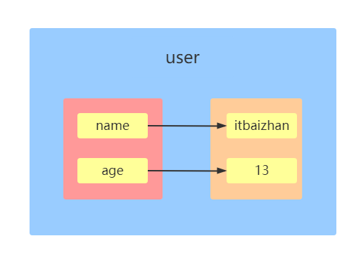

```js
var user = {
  name: 'itbaizhan',
  age: '13'
};
```


对象的每一个键名又称为“属性”（property），它的“键

值”可以是任何数据类型。如果一个属性的值为函数，通常把这个属性称为“方法”，它可以像函数那样调用

```js
var user = {
  getName: function (name) {
    return name;
  }
};
user.getName("itbaizhan") // itbaizhan
```

如果属性的值还是一个对象，就形成了链式引用

```js
var user = {
    name:"itbaizhan",
    age:13,
    container:{
        frontEnd:["Web前端","Android","iOS"],
        backEnd:["Java","Python"]
    }
}
user.container.frontEnd // ["Web前端","Android","iOS"]
```


**实时效果反馈**

**1. 下列关于对象描述正确的是：**

<font style="background-color:rgb(233, 30, 100)">A</font>   对象是条件语句，负责进行判断

<font style="background-color:rgb(255, 197, 10)">B</font>   对象是一段反复调用的代码块

<font style="background-color:#8bc34a">C</font>   对象就是一组“键值对”（key-value）的集合

<font style="background-color:rgb(2, 170, 244);">D</font>   对象是按次序排列的一组值。每个值的位置都有编号（从0开始）


**答案**

1=>C    


## Math对象


Math是 JavaScript 的原生对象，提供各种数学功能。


### Math.abs()

**`Math.abs`方法返回参数值的绝对值**

```js
Math.abs(1) // 1
Math.abs(-1) // 1
```


### Math.max()，Math.min()

`Math.max`方法返回参数之中最大的那个值，`Math.min`返回最小的那个值。如果参数为空, `Math.min`返回`Infinity`, `Math.max`返回`-Infinity`。

```js
Math.max(2, -1, 5) // 5
Math.min(2, -1, 5) // -1
Math.min() // Infinity
Math.max() // -Infinity
```


### Math.floor()，Math.ceil()

`Math.floor`方法返回小于参数值的最大整数

```js
Math.floor(3.2) // 3
Math.floor(-3.2) // -4
```

`Math.ceil`方法返回大于参数值的最小整数

```js
Math.ceil(3.2) // 4
Math.ceil(-3.2) // -3
```


### Math.random()

`Math.random()`返回0到1之间的一个伪随机数，可能等于0，但是一定小于1

```js
Math.random() // 0.28525367438365223
```

任意范围的随机数生成函数如下

```js
function getRandomArbitrary(min, max) {
  return Math.random() * (max - min) + min;
}

getRandomArbitrary(5, 10)
```


**实时效果反馈**

**1. 下列代码获得一个正整数，横线处应该填写的内容是：**

```js
function ToInteger(x) {
    x = Number(x);
    return ___(___(x));
}
ToInteger(-10.4); // 向下取整：10
```

<font style="background-color:rgb(233, 30, 100)">A</font>   `Math.floor`  `Math.abs`

<font style="background-color:rgb(255, 197, 10)">B</font>   `Math.ceil`  `Math.abs`

<font style="background-color:#8bc34a">C</font>   `Math.ceil`  `Math.min`

<font style="background-color:rgb(2, 170, 244);">D</font>   `Math.floor`  `Math.min`


**答案**

1=>A 


## Date对象


`Date`对象是 JavaScript 原生的时间库。它以1970年1月1日00:00:00作为时间的零点，可以表示的时间范围是前后各1亿天（单位为毫秒）


### Date.now()

`Date.now`方法返回当前时间距离时间零点（1970年1月1日 00:00:00 UTC）的毫秒数，相当于 Unix 时间戳乘以1000

```js
Date.now();   // 1635216733395
```


### 时间戳

时间戳是指格林威治时间1970年01月01日00时00分00秒(北京时间1970年01月01日08时00分00秒)起至现在的总秒数。

格林威治和北京时间就是时区的不同

Unix是20世纪70年代初出现的一个操作系统，Unix认为1970年1月1日0点是时间纪元。JavaScript也就遵循了这一约束


`Date`对象提供了一系列`get*`方法，用来获取实例对象某个方面的值

> **实例方法get类**
>
> getTime()：返回实例距离1970年1月1日00:00:00的毫秒数
> getDate()：返回实例对象对应每个月的几号（从1开始）
> getDay()：返回星期几，星期日为0，星期一为1，以此类推
> getYear()：返回距离1900的年数
> getFullYear()：返回四位的年份
> getMonth()：返回月份（0表示1月，11表示12月）
> getHours()：返回小时（0-23）
> getMilliseconds()：返回毫秒（0-999）
> getMinutes()：返回分钟（0-59）
> getSeconds()：返回秒（0-59）

```js
var d = new Date('January 6, 2022');
d.getDate() // 6
d.getMonth() // 0
d.getYear() // 122
d.getFullYear() // 2022
```

编写函数获得本年度剩余天数

```js
function leftDays() {
  var today = new Date();
  var endYear = new Date(today.getFullYear(), 11, 31, 23, 59, 59, 999);
  var msPerDay = 24 * 60 * 60 * 1000;
  return Math.round((endYear.getTime() - today.getTime()) / msPerDay);
}
```


**实时效果反馈**

**1. 下列代码计算本年度剩余天数，划横线处应该填写代码是：**

```js
function leftDays() {
  var today = new Date();
  var endYear = new Date(today.___, 11, 31, 23, 59, 59, 999);
  var msPerDay = 24 * 60 * 60 * 1000;
  return Math.round((endYear.___ - today.___) / msPerDay);
}
```

<font style="background-color:rgb(233, 30, 100)">A</font>   getTime()   getDate()   getTime()   

<font style="background-color:rgb(255, 197, 10)">B</font>   getTime()   getTime()    getDate()

<font style="background-color:#8bc34a">C</font>   getFullYear()   getTime()   getDate()

<font style="background-color:rgb(2, 170, 244);">D</font>   getFullYear()  getTime()   getTime()


**答案**

1=>D  


## DOM概述


DOM 是 JavaScript 操作网页的接口，全称为“文档对象模型”（Document Object Model）。它的作用是将网页转为一个 JavaScript 对象，从而可以用脚本进行各种操作（比如对元素增删内容）

浏览器会根据 DOM 模型，将结构化文档HTML解析成一系列的节点，再由这些节点组成一个树状结构（DOM Tree）。所有的节点和最终的树状结构，都有规范的对外接口

DOM 只是一个接口规范，可以用各种语言实现。所以严格地说，DOM 不是 JavaScript 语法的一部分，但是 DOM 操作是 JavaScript 最常见的任务，离开了 DOM，JavaScript 就无法控制网页。另一方面，JavaScript 也是最常用于 DOM 操作的语言


### 节点

DOM 的最小组成单位叫做节点（node）。文档的树形结构（DOM 树），就是由各种不同类型的节点组成。每个节点可以看作是文档树的一片叶子

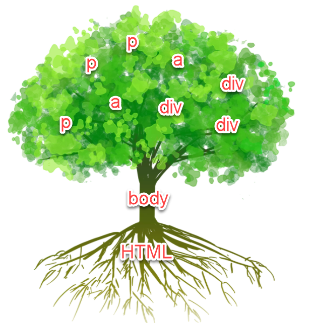

节点的类型有七种

> Document：整个文档树的顶层节点
> DocumentType：doctype标签
> Element：网页的各种HTML标签
> Attribute：网页元素的属性（比如class="right"）
> Text：标签之间或标签包含的文本
> Comment：注释
> DocumentFragment：文档的片段


### 节点树

一个文档的所有节点，按照所在的层级，可以抽象成一种树状结构。这种树状结构就是 DOM 树。它有一个顶层节点，下一层都是顶层节点的子节点，然后子节点又有自己的子节点，就这样层层衍生出一个金字塔结构，倒过来就像一棵树


浏览器原生提供document节点，代表整个文档

```js
document
// 整个文档树
```

除了根节点，其他节点都有三种层级关系

> 父节点关系（parentNode）：直接的那个上级节点
> 子节点关系（childNodes）：直接的下级节点
> 同级节点关系（sibling）：拥有同一个父节点的节点

### Node.nodeType属性

不同节点的nodeType属性值和对应的常量如下

> 文档节点（document）：9，对应常量Node.DOCUMENT_NODE
> 元素节点（element）：1，对应常量Node.ELEMENT_NODE
> 属性节点（attr）：2，对应常量Node.ATTRIBUTE_NODE
> 文本节点（text）：3，对应常量Node.TEXT_NODE
> 文档片断节点（DocumentFragment）：11，对应常量Node.DOCUMENT_FRAGMENT_NODE

```js
document.nodeType // 9
document.nodeType === Node.DOCUMENT_NODE // true
```


**实时效果反馈**

**1. 下列那个不是节点类型：**

<font style="background-color:rgb(233, 30, 100)">A</font>   Document

<font style="background-color:rgb(255, 197, 10)">B</font>   Element

<font style="background-color:#8bc34a">C</font>   Attribute

<font style="background-color:rgb(2, 170, 244);">D</font>   Array


**答案**

1=>D  


## document对象_方法/获取元素


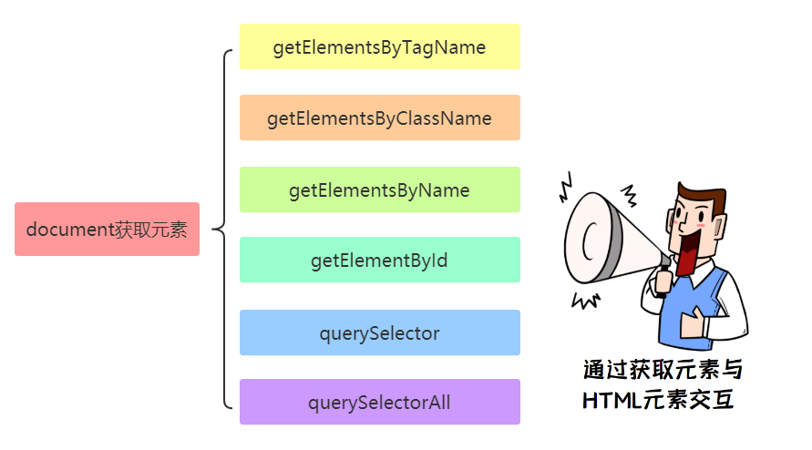


### document.getElementsByTagName()

`document.getElementsByTagName`方法搜索 HTML 标签名，返回符合条件的元素。它的返回值是一个类似数组对象（`HTMLCollection`实例），可以实时反映 HTML 文档的变化。如果没有任何匹配的元素，就返回一个空集

```js
var paras = document.getElementsByTagName('p');
```

如果传入`*`，就可以返回文档中所有 HTML 元素

```js
var allElements = document.getElementsByTagName('*');
```


### document.getElementsByClassName()

`document.getElementsByClassName`方法返回一个类似数组的对象（`HTMLCollection`实例），包括了所有`class`名字符合指定条件的元素，元素的变化实时反映在返回结果中

```js
var elements = document.getElementsByClassName(names);
```

由于`class`是保留字，所以 JavaScript 一律使用`className`表示 CSS 的`class`

参数可以是多个`class`，它们之间使用空格分隔

```js
var elements = document.getElementsByClassName('foo bar');
```


### document.getElementsByName()

`document.getElementsByName`方法用于选择拥有`name`属性的 HTML 元素（比如`<form>`、`<radio>`、``等），返回一个类似数组的的对象（`NodeList`实例），因为`name`属性相同的元素可能不止一个

```js
// 表单为 <form name="itbaizhan"></form>
var forms = document.getElementsByName('itbaizhan');
```


### document.getElementById()

`document.getElementById`方法返回匹配指定`id`属性的元素节点。如果没有发现匹配的节点，则返回`null`

```js
var elem = document.getElementById('para1');
```

注意，该方法的参数是大小写敏感的。比如，如果某个节点的`id`属性是`main`，那么`document.getElementById('Main')`将返回`null`


### document.querySelector()

`document.querySelector`方法接受一个 CSS 选择器作为参数，返回匹配该选择器的元素节点。如果有多个节点满足匹配条件，则返回第一个匹配的节点。如果没有发现匹配的节点，则返回`null`

```js
var el1 = document.querySelector('.myclass');
```


### document.querySelectorAll()

`document.querySelectorAll`方法与`querySelector`用法类似，区别是返回一个`NodeList`对象，包含所有匹配给定选择器的节点

```js
var elementList = document.querySelectorAll('.myclass');
```


**实时效果反馈**

**1. 以下那个是通过ID获取元素对象：**

<font style="background-color:rgb(233, 30, 100)">A</font>   getElementById

<font style="background-color:rgb(255, 197, 10)">B</font>   getElementsByTagName

<font style="background-color:#8bc34a">C</font>   getElementsByClassName

<font style="background-color:rgb(2, 170, 244);">D</font>   getElementsByName


**2. 以下那个是通过Class获取元素对象：**

<font style="background-color:rgb(233, 30, 100)">A</font>   getElementById

<font style="background-color:rgb(255, 197, 10)">B</font>   getElementsByTagName

<font style="background-color:#8bc34a">C</font>   getElementsByClassName

<font style="background-color:rgb(2, 170, 244);">D</font>   getElementsByName


**答案**

1=>A      2=>C


## document对象_方法/创建元素


### document.createElement()

`document.createElement`方法用来生成元素节点，并返回该节点

```js
var newDiv = document.createElement('div');
```


### document.createTextNode()

`document.createTextNode`方法用来生成文本节点（`Text`实例），并返回该节点。它的参数是文本节点的内容

```js
var newDiv = document.createElement('div');
var newContent = document.createTextNode('Hello');
newDiv.appendChild(newContent);
```


### document.createAttribute()

`document.createAttribute`方法生成一个新的属性节点（`Attr`实例），并返回它

```js
var attribute = document.createAttribute(name);
```

```js
var root = document.getElementById('root');
var it = document.createAttribute('itbaizhan');
it.value = 'it';
root.setAttributeNode(it);
```


**实时效果反馈**

**1. 下列代码是创建元素，并添加内容，横线处应该填写的内容是：**

```js
var newDiv = document.createElement('div');
var newContent = document.____('Hello');
newDiv.appendChild(newContent);
```

<font style="background-color:rgb(233, 30, 100)">A</font>   createElement

<font style="background-color:rgb(255, 197, 10)">B</font>   appendChild

<font style="background-color:#8bc34a">C</font>   createAttribute

<font style="background-color:rgb(2, 170, 244);">D</font>   createTextNode


**答案**

1=>D  


## Element对象_属性


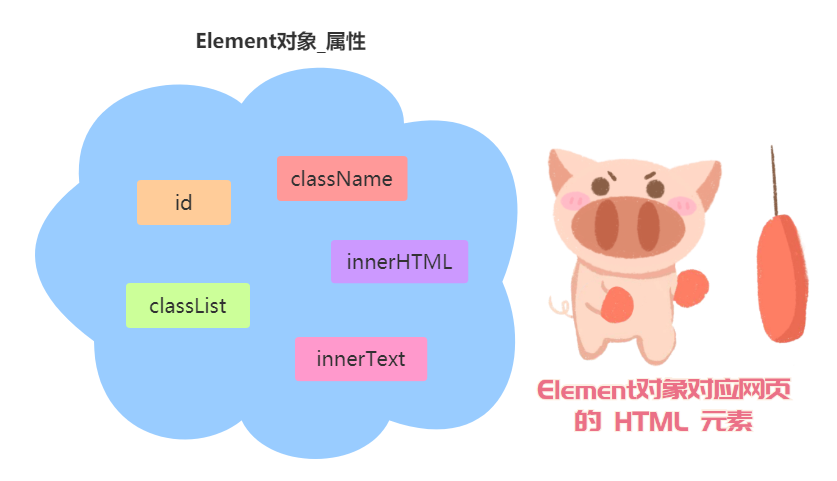


Element对象对应网页的 HTML 元素。每一个 HTML 元素，在 DOM 树上都会转化成一个Element节点对象（以下简称元素节点） 

### Element.id

`Element.id`属性返回指定元素的`id`属性，该属性可读写

```js
// HTML 代码为 <p id="foo">
var p = document.querySelector('p');
p.id // "foo"
```

### Element.className

`className`属性用来读写当前元素节点的`class`属性。它的值是一个字符串，每个`class`之间用空格分割

```js
// HTML 代码 <div class="one two three" id="myDiv"></div>
var div = document.getElementById('myDiv');
div.className
```

### Element.classList

`classList`对象有下列方法

> - `add()`：增加一个 class。
> - `remove()`：移除一个 class。
> - `contains()`：检查当前元素是否包含某个 class。
> - `toggle()`：将某个 class 移入或移出当前元素。

```js
var div = document.getElementById('myDiv');

div.classList.add('myCssClass');
div.classList.add('foo', 'bar');
div.classList.remove('myCssClass');
div.classList.toggle('myCssClass'); // 如果 myCssClass 不存在就加入，否则移除
div.classList.contains('myCssClass'); // 返回 true 或者 false
```

### Element.innerHTML

`Element.innerHTML`属性返回一个字符串，等同于该元素包含的所有 HTML 代码。该属性可读写，常用来设置某个节点的内容。它能改写所有元素节点的内容，包括`<HTML>`和`<body>`元素

```js
el.innerHTML = '';
```

### Element.innerText

`innerText`和`innerHTML`类似，不同的是`innerText`无法识别元素，会直接渲染成字符串


**实时效果反馈**

**1. 下列代码为div元素动态添加一个class，画横线处应该填写的内容是：**

```js
var div = document.getElementById('myDiv');
div.classList.___('myCssClass');
```

<font style="background-color:rgb(233, 30, 100)">A</font>   remove

<font style="background-color:rgb(255, 197, 10)">B</font>   add

<font style="background-color:#8bc34a">C</font>   toggle

<font style="background-color:rgb(2, 170, 244);">D</font>   contains


**答案**

1=>B  


## Element获取元素位置


| 属性         |                             描述                             |
| :----------- | :----------------------------------------------------------: |
| clientHeight | 获取元素高度包括`padding`部分，但是不包括`border`、`margin`  |
| clientWidth  | 获取元素宽度包括`padding`部分，但是不包括`border`、`margin`  |
| scrollHeight | 元素总高度，它包括`padding`，但是不包括`border`、`margin`包括溢出的不可见内容 |
| scrollWidth  | 元素总宽度，它包括`padding`，但是不包括`border`、`margin`包括溢出的不可见内容 |
| scrollLeft   |              元素的水平滚动条向右滚动的像素数量              |
| scrollTop    |              元素的垂直滚动条向下滚动的像素数量              |
| offsetHeight | 元素的 CSS 垂直高度（单位像素），包括元素本身的高度、padding 和 border |
| offsetWidth  | 元素的 CSS 水平宽度（单位像素），包括元素本身的高度、padding 和 border |
| offsetLeft   |                    到定位父级左边界的间距                    |
| offsetTop    |                    到定位父级上边界的间距                    |


### Element.clientHeight，Element.clientWidth

`Element.clientHeight`属性返回一个整数值，表示元素节点的 CSS 高度（单位像素），只对块级元素生效，对于行内元素返回`0`。如果块级元素没有设置 CSS 高度，则返回实际高度

除了元素本身的高度，它还包括`padding`部分，但是不包括`border`、`margin`。如果有水平滚动条，还要减去水平滚动条的高度。注意，这个值始终是整数，如果是小数会被四舍五入。

`Element.clientWidth`属性返回元素节点的 CSS 宽度，同样只对块级元素有效，也是只包括元素本身的宽度和`padding`，如果有垂直滚动条，还要减去垂直滚动条的宽度。

`document.documentElement`的`clientHeight`属性，返回当前视口的高度（即浏览器窗口的高度）。`document.body`的高度则是网页的实际高度。

```js
// 视口高度
document.documentElement.clientHeight

// 网页总高度
document.body.clientHeight
```


### Element.scrollHeight，Element.scrollWidth

`Element.scrollHeight`属性返回一个整数值（小数会四舍五入），表示当前元素的总高度（单位像素），它包括`padding`，但是不包括`border`、`margin`以及水平滚动条的高度（如果有水平滚动条的话）

`Element.scrollWidth`属性表示当前元素的总宽度（单位像素），其他地方都与`scrollHeight`属性类似。这两个属性只读

整张网页的总高度可以从`document.documentElement`或`document.body`上读取

```js
// 返回网页的总高度
document.documentElement.scrollHeight
document.body.scrollHeight
```


### Element.scrollLeft，Element.scrollTop

`Element.scrollLeft`属性表示当前元素的水平滚动条向右侧滚动的像素数量，`Element.scrollTop`属性表示当前元素的垂直滚动条向下滚动的像素数量。对于那些没有滚动条的网页元素，这两个属性总是等于0

如果要查看整张网页的水平的和垂直的滚动距离，要从`document.documentElement`元素上读取

```js
document.documentElement.scrollLeft
document.documentElement.scrollTop
```


### Element.offsetHeight，Element.offsetWidth

`Element.offsetHeight`属性返回一个整数，表示元素的 CSS 垂直高度（单位像素），包括元素本身的高度、padding 和 border，以及水平滚动条的高度（如果存在滚动条）。

`Element.offsetWidth`属性表示元素的 CSS 水平宽度（单位像素），其他都与`Element.offsetHeight`一致。

这两个属性都是只读属性，只比`Element.clientHeight`和`Element.clientWidth`多了边框的高度或宽度。如果元素的 CSS 设为不可见（比如`display: none;`），则返回`0`


### Element.offsetLeft，Element.offsetTop

`Element.offsetLeft`返回当前元素左上角相对于`Element.offsetParent`节点的水平位移，`Element.offsetTop`返回垂直位移，单位为像素。通常，这两个值是指相对于父节点的位移

```html
<div class="parent">
    <div class="box" id="box"></div>
</div>
```

```css
.parent{
    width: 200px;
    height: 200px;
    background: red;
    position: relative;
    left: 50px;
    top: 50px;
}

.box{
    width: 100px;
    height: 100px;
    background: yellow;
    position: relative;
    left: 50px;
    top: 50px;
}
```

```js
var box = document.getElementById("box");
console.log(box.offsetLeft);
console.log(box.offsetTop);
```


**实时效果反馈**

**1. 下面是获得整个视口的宽度和高度：**

```js
document.documentElement.___
document.documentElement.___
```

<font style="background-color:rgb(233, 30, 100)">A</font>   offsetLeft    offsetTop

<font style="background-color:rgb(255, 197, 10)">B</font>   scrollHeight   scrollWidth

<font style="background-color:#8bc34a">C</font>   clientLeft     clientTop


**2. 以下哪个是获得元素的高度，包含内外边距和边框：**

<font style="background-color:rgb(233, 30, 100)">A</font>   offsetLeft    offsetTop

<font style="background-color:rgb(255, 197, 10)">B</font>   offsetHeight     offsetWidth

<font style="background-color:#8bc34a">C</font>   clientLeft     clientTop

<font style="background-color:rgb(2, 170, 244);">D</font>   clientHeight    clientWidth


**答案**

1=>B   2=>B


## CSS操作


### `HTML` 元素的 `style` 属性

操作 CSS 样式最简单的方法，就是使用网页元素节点的`setAttribute`方法直接操作网页元素的`style`属性

```js
div.setAttribute(
  'style',
  'background-color:red;' + 'border:1px solid black;'
);
```


### 元素节点的`style`属性

```js
var divStyle = document.querySelector('div').style;

divStyle.backgroundColor = 'red';
divStyle.border = '1px solid black';
divStyle.width = '100px';
divStyle.height = '100px';
divStyle.fontSize = '10em';
```


### `cssText`属性

```js
var divStyle = document.querySelector('div').style;

divStyle.cssText = 'background-color: red;'
  + 'border: 1px solid black;'
  + 'height: 100px;'
  + 'width: 100px;';
```


**实时效果反馈**

**1. 下列是设置样式的代码，横线处应该填写的代码是：**

```js
var divStyle = document.querySelector('div');
divStyle.___.backgroundColor = 'red';
```

<font style="background-color:rgb(233, 30, 100)">A</font>   `style`

<font style="background-color:rgb(255, 197, 10)">B</font>   `cssText`

<font style="background-color:#8bc34a">C</font>   `setAttribute`

<font style="background-color:rgb(2, 170, 244);">D</font>   `getAttribute`


**答案**

1=>A


## 事件处理程序


事件处理程序分为：

1. HTML事件处理
2. DOM0级事件处理
3. DOM2级事件处理


### HTML事件

```html
<!DOCTYPE html>
<html>
    <head lang="en">
        <meta charset="UTF-8">
        <title>Js事件详解--事件处理</title>
    </head>
    <body>
        <div id="div">
            <button id="btn1" onclick="demo()">按钮</button>
        </div>
        <script>
            function demo(){
                alert("hello html事件处理");
            }
        </script>
    </body>
</html> 
```


### DOM0级事件处理

```html
<body>
    <div id="div">
        <button id="btn1">按钮</button>
    </div>
    <script>
        var btn1=document.getElementById("btn1");
        btn1.onclick=function(){alert("Hello DOM0级事件处理程序1");}//被覆盖掉
        btn1.onclick=function(){alert("Hello DOM0级事件处理程序2");}
    </script>
</body>
```


### DOM2级事件处理

```html
<body>
    <div id="div">
        <button id="btn1">按钮</button>
    </div>
    <script>
        var btn1=document.getElementById("btn1");
        btn1.addEventListener("click",demo1);
        btn1.addEventListener("click",demo2);
        btn1.addEventListener("click",demo3);
        function demo1(){
            alert("DOM2级事件处理程序1")
        }
        function demo2(){
            alert("DOM2级事件处理程序2")
        }
        function demo3(){
            alert("DOM2级事件处理程序3")
        }
        btn1.removeEventListener("click",demo2);
    </script>
</body>
```


**实时效果反馈**

**1. 下列代码，是属于哪种事件处理方式：**

```js
btn2.addEventListener('click',function(){
	console.log("触发事件");
})
```

<font style="background-color:rgb(233, 30, 100)">A</font>   HTML事件

<font style="background-color:rgb(255, 197, 10)">B</font>   DOM0级事件处理

<font style="background-color:#8bc34a">C</font>   DOM2级事件处理

<font style="background-color:rgb(2, 170, 244);">D</font>   IE事件处理程序


**答案**

1=>C


## 事件类型之鼠标事件


### 鼠标事件

鼠标事件指与鼠标相关的事件，具体的事件主要有以下一些

1. click：按下鼠标时触发
2. dblclick：在同一个元素上双击鼠标时触发
3. mousedown：按下鼠标键时触发
4. mouseup：释放按下的鼠标键时触发
5. mousemove：当鼠标在节点内部移动时触发。当鼠标持续移动时，该事件会连触发。
6. mouseenter：鼠标进入一个节点时触发，进入子节点不会触发这个事件
7. mouseleave：鼠标离开一个节点时触发，离开父节点不会触发这个事件
8. mouseover：鼠标进入一个节点时触发，进入子节点会再一次触发这个事件
9. mouseout：鼠标离开一个节点时触发，离开父节点也会触发这个事件
10. wheel：滚动鼠标的滚轮时触发


```js
var btn1 = document.getElementById("btn1");
btn1.onclick = function(){
    console.log("click事件");
}
```

> **温馨提示**
>
> 这些方法在使用的时候，除了DOM2级事件，都需要添加前缀`on`


**实时效果反馈**

**1. 下列代码是鼠标事件，划横线处应该填写的是：**

```js
// 需求：鼠标在元素内移动，会一直触发事件
var box = document.getElementById("box");
box.___ = function(){
    console.log("事件在元素上会一直触发");
}
```

<font style="background-color:rgb(233, 30, 100)">A</font>   `onclick`

<font style="background-color:rgb(255, 197, 10)">B</font>   `onmouseover`

<font style="background-color:#8bc34a">C</font>   `onmousemove`

<font style="background-color:rgb(2, 170, 244);">D</font>   `onmouseenter`


**答案**

1=>C


## Event事件对象


事件发生以后，会产生一个事件对象，作为参数传给监听函数。


### Event对象属性

1. Event.Target
2. Event.type


#### Event.target

Event.target属性返回事件当前所在的节点

```js
// HTML代码为
// <p id="para">Hello</p>
function setColor(e) {
  console.log(this === e.target);
  e.target.style.color = 'red';
}

para.addEventListener('click', setColor);
```


#### Event.type

Event.type属性返回一个字符串，表示事件类型。事件的类型是在生成事件的时候。该属性只读


### Event对象方法

1. Event.preventDefault()
2. Event.stopPropagation()


#### Event.preventDefault

Event.preventDefault方法取消浏览器对当前事件的默认行为。比如点击链接后，浏览器默认会跳转到另一个页面，使用这个方法以后，就不会跳转了

```js
btn.onclick = function(e){
    e.preventDefault(); // 阻止默认事件
    console.log("点击A标签");
}
```


#### Event.stopPropagation()

stopPropagation方法阻止事件在 DOM 中继续传播，防止再触发定义在别的节点上的监听函数，但是不包括在当前节点上其他的事件监听函数

```js
btn.onclick = function(e){
    e.stopPropagation(); // 阻止事件冒泡
    console.log("btn");
}
```


**实时效果反馈**

**1. 下列关于阻止默认事件方法正确的是：**

<font style="background-color:rgb(233, 30, 100)">A</font>   stopPropagation()

<font style="background-color:rgb(255, 197, 10)">B</font>   preventDefault()

<font style="background-color:#8bc34a">C</font>   target

<font style="background-color:rgb(2, 170, 244);">D</font>   currentTarget


**答案**

1=>B


## 事件类型之键盘事件


键盘事件由用户击打键盘触发，主要有keydown、keypress、keyup三个事件

1. keydown：按下键盘时触发。
2. keypress：按下有值的键时触发，即按下 Ctrl、Alt、Shift、Meta 这样无值的键，这个事件不会触发。对于有值的键，按下时先触发keydown事件，再触发这个事件。
3. keyup：松开键盘时触发该事件

```js
username.onkeypress = function(e){
    console.log("keypress事件");
}
```


### event对象

keyCode:唯一标识

```js
var username = document.getElementById("username");
username.onkeydown = function(e){
    if(e.keyCode === 13){
        console.log("回车");
    }
}
```


**实时效果反馈**

**1. 下列那个不是键盘事件：**

<font style="background-color:rgb(233, 30, 100)">A</font>   keydown

<font style="background-color:rgb(255, 197, 10)">B</font>   keypress

<font style="background-color:#8bc34a">C</font>   keyup

<font style="background-color:rgb(2, 170, 244);">D</font>   click


**答案**

1=>D  


## 事件类型之表单事件


表单事件是在使用表单元素及输入框元素可以监听的一系列事件

1. input事件
2. select事件
3. Change事件
4. reset事件
5. submit事件


### input事件

input事件当`<input>、<select>、<textarea>`的值发生变化时触发。对于复选框（`<input type=checkbox>`）或单选框（`<input type=radio>`），用户改变选项时，也会触发这个事件

input事件的一个特点，就是会连续触发，比如用户每按下一次按键，就会触发一次input事件。

```js
var username = document.getElementById("username");
username.oninput = function(e){
    console.log(e.target.value);
}
```


### select事件

select事件当在`<input>、<textarea>`里面选中文本时触发

```js
// HTML 代码如下
// <input id="test" type="text" value="Select me!" />

var elem = document.getElementById('test');
elem.addEventListener('select', function (e) {
  console.log(e.type); // "select"
}, false);
```


### Change 事件

Change事件当`<input>、<select>、<textarea>`的值发生变化时触发。它与input事件的最大不同，就是不会连续触发，只有当全部修改完成时才会触发

```js
var email = document.getElementById("email");
email.onchange = function(e){
    console.log(e.target.value);
}
```


### reset 事件，submit 事件

这两个事件发生在表单对象`<form>`上，而不是发生在表单的成员上。

reset事件当表单重置（所有表单成员变回默认值）时触发。

submit事件当表单数据向服务器提交时触发。注意，submit事件的发生对象是`<form>`元素，而不是`<button>`元素，因为提交的是表单，而不是按钮

```html
<form id="myForm" onsubmit="submitHandle">
    <button onclick="resetHandle">重置数据</button>
    <button>提交</button>
</form>
```

```js
var myForm = document.getElementById("myForm")
function resetHandle(){
    myForm.reset();
}
function submitHandle(){
    console.log("提交");
}
```


**实时效果反馈**

**1. 下列代码中，横线处应该填写的内容是：**

```js
// 需求：用户每次输入都需要触发的事件
var username = document.getElementById("username");
username.___ = function(e){
    console.log(e.target.value);
}
```

<font style="background-color:rgb(233, 30, 100)">A</font>   select

<font style="background-color:rgb(255, 197, 10)">B</font>   oninput

<font style="background-color:#8bc34a">C</font>   onchange

<font style="background-color:rgb(2, 170, 244);">D</font>   submit 


**答案**

1=>B  


## 事件代理(事件委托)


由于事件会在冒泡阶段向上传播到父节点，因此可以把子节点的监听函数定义在父节点上，由父节点的监听函数统一处理多个子元素的事件。这种方法叫做事件的代理（delegation）

```js
var ul = document.querySelector('ul');

ul.addEventListener('click', function (event) {
  if (event.target.tagName.toLowerCase() === 'li') {
    // some code
  }
});
```


**实时效果反馈**

**1. 下列是关于事件代理的处理，横线处应该填写的代码是：**

```js
var parent = document.getElementById("parent");
parent.addEventListener("click",function(e){
    if(e.___.tagName.___ === 'li'){
        console.log(e.target.innerHTML);
    }
})
```

<font style="background-color:rgb(233, 30, 100)">A</font>   target    toUpperCase()

<font style="background-color:rgb(255, 197, 10)">B</font>   target    toLowerCase()

<font style="background-color:#8bc34a">C</font>   currentTarget   toLowerCase()

<font style="background-color:rgb(2, 170, 244);">D</font>   currentTarget   toUpperCase()


**答案**

1=>B  


## 定时器之`setTimeout()`


JavaScript 提供定时执行代码的功能，叫做定时器（timer），主要由`setTimeout()`和`setInterval()`这两个函数来完成。它们向任务队列添加定时任务

`setTimeout`函数用来指定某个函数或某段代码，在多少毫秒之后执行。它返回一个整数，表示定时器的编号，以后可以用来取消这个定时器。

```js
var timerId = setTimeout(func|code, delay);
```

`setTimeout`函数接受两个参数，第一个参数`func|code`是将要推迟执行的函数名或者一段代码，第二个参数`delay`是推迟执行的毫秒数

```js
setTimeout(function(){
    console.log("定时器")
},1000)
```


> **温馨提示**
>
> 还有一个需要注意的地方，如果回调函数是对象的方法，那么`setTimeout`使得方法内部的`this`关键字指向全局环境，而不是定义时所在的那个对象


```js
var name = "sxt";
var user = {
    name: "itbaizhan",
    getName: function () {
        setTimeout(function(){
            console.log(this.name);
        },1000)
    }
};
user.getName();
```


解决方案

```js
var name = "sxt";
var user = {
    name: "itbaizhan",
    getName: function () {
        var that = this;
        setTimeout(function(){
            console.log(that.name);
        },1000)
    }
};
user.getName();
```


定时器可以进行取消

```js
var id = setTimeout(f, 1000);
clearTimeout(id);
```


**实时效果反馈**

**1. 以下是关于定时器`setTimeout`代码，运行结果是：**

```js
var name = "sxt";
var user = {
    name: "itbaizhan",
    getName: function () {
        var that = this;
        setTimeout(function(){
            console.log(that.name);
        },1000)
    }
};
user.getName();
```

<font style="background-color:rgb(233, 30, 100)">A</font>   itbaizhan

<font style="background-color:rgb(255, 197, 10)">B</font>   sxt

<font style="background-color:#8bc34a">C</font>   报错

<font style="background-color:rgb(2, 170, 244);">D</font>   undefined


**答案**

1=>A  


## 定时器之`setInterval()`


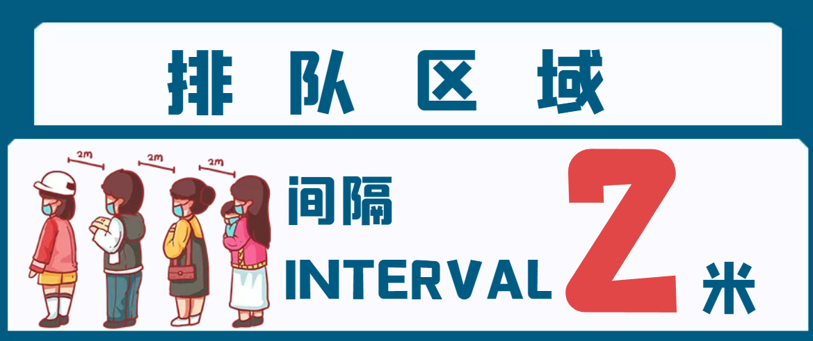


`setInterval`函数的用法与`setTimeout`完全一致，区别仅仅在于`setInterval`指定某个任务每隔一段时间就执行一次，也就是无限次的定时执行

```js
var timer = setInterval(function() {
  console.log(2);
}, 1000)
```


通过setInterval方法实现网页动画

```html
<!DOCTYPE html>
<html lang="en">
<head>
	<meta charset="UTF-8">
	<meta name="viewport" content="width=device-width, initial-scale=1.0">
	<title>Document</title>
	<style>
		#someDiv{
			width: 100px;
			height: 100px;
			background: red;
		}
	</style>
</head>
<body>
	<div id="someDiv"></div>
	<script>
		var div = document.getElementById('someDiv');
		var opacity = 1;
		var fader = setInterval(function() {
		  opacity -= 0.05;
		  if (opacity > 0) {
		    div.style.opacity = opacity;
		  } else {
		    clearInterval(fader);
		  }
		}, 30);

	</script>
</body>
</html>
```


定时器可以进行取消

```js
var id = setInterval(f, 1000);
clearInterval(id);
```


**实时效果反馈**

**1. 以下是关于定时器`setInterval`代码，每秒打印当前时间，横线处填写代码是：**

```js
___(function(){
    console.log(new Date().toLocaleTimeString());
},1000)
```

<font style="background-color:rgb(233, 30, 100)">A</font>   getTime

<font style="background-color:rgb(255, 197, 10)">B</font>   setTimeout

<font style="background-color:#8bc34a">C</font>   setInterval

<font style="background-color:rgb(2, 170, 244);">D</font>   function


**答案**

1=>C  


## 防抖(debounce)


防抖严格算起来应该属于性能优化的知识，但实际上遇到的频率相当高，处理不当或者放任不管就容易引起浏览器卡死。

从滚动条监听的例子说起

```js
function showTop  () {
    var scrollTop = document.documentElement.scrollTop;
    console.log('滚动条位置：' + scrollTop);
}
window.onscroll  = showTop
```

在运行的时候会发现存在一个问题：这个函数的默认执行频率，太！高！了！。 高到什么程度呢？以chrome为例，我们可以点击选中一个页面的滚动条，然后点击一次键盘的【向下方向键】，会发现函数执行了8-9次！


然而实际上我们并不需要如此高频的反馈，毕竟浏览器的性能是有限的，不应该浪费在这里，所以接着讨论如何优化这种场景。

基于上述场景，首先提出第一种思路：在第一次触发事件时，不立即执行函数，而是给出一个期限值比如200ms，然后

1. 如果在200ms内没有再次触发滚动事件，那么就执行函数
2. 如果在200ms内再次触发滚动事件，那么当前的计时取消，重新开始计时

效果：如果短时间内大量触发同一事件，只会执行一次函数


实现：既然前面都提到了计时，那实现的关键就在于setTimeout这个函数，由于还需要一个变量来保存计时，考虑维护全局纯净，可以借助闭包来实现

```js
function debounce(fn,delay){
    let timer = null //借助闭包
    return function() {
        if(timer){
            clearTimeout(timer) 
        }
        timer = setTimeout(fn,delay) // 简化写法
    }
}
// 然后是旧代码
function showTop  () {
    var scrollTop = document.documentElement.scrollTop;
    console.log('滚动条位置：' + scrollTop);
}
window.onscroll = debounce(showTop,300)
```


到这里，已经把防抖实现了

> **防抖定义**
>
> 对于短时间内连续触发的事件（上面的滚动事件），防抖的含义就是让某个时间期限（如上面的1000毫秒）内，事件处理函数只执行一次


**实时效果反馈**

**1. 以下是关于定时器防抖代码，横线处填写代码是：**

```js
function debounce(fn,delay){
    let timer = null 
    return function() {
        if(timer){
            _2_(timer) 
        }
        timer = _1_(fn,delay) 
    }
}
function showTop  () {
    var scrollTop = document.documentElement.scrollTop;
    console.log('滚动条位置：' + scrollTop);
}
window.onscroll = debounce(showTop,300)
```

<font style="background-color:rgb(233, 30, 100)">A</font>   setTimeout   clearInterval

<font style="background-color:rgb(255, 197, 10)">B</font>   setTimeout   clearTimeout

<font style="background-color:#8bc34a">C</font>   setInterval    clearTimeout

<font style="background-color:rgb(2, 170, 244);">D</font>   setInterval    clearInterval


**答案**

1=>B  


## 节流(throttle)


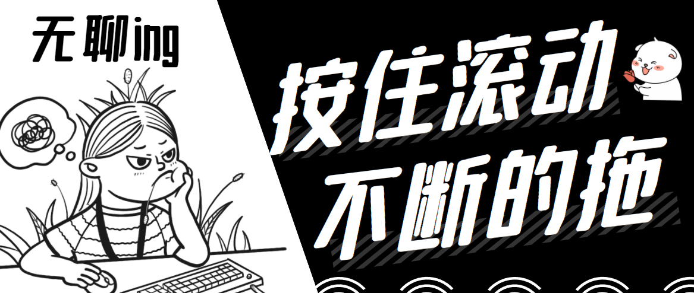


节流严格算起来应该属于性能优化的知识，但实际上遇到的频率相当高，处理不当或者放任不管就容易引起浏览器卡死


继续思考，使用上面的防抖方案来处理问题的结果是

如果在限定时间段内，不断触发滚动事件（比如某个用户闲着无聊，按住滚动不断的拖来拖去），只要不停止触发，理论上就永远不会输出当前距离顶部的距离

但是如果产品同学的期望处理方案是：即使用户不断拖动滚动条，也能在某个时间间隔之后给出反馈呢？

其实很简单：我们可以设计一种类似控制阀门一样定期开放的函数，也就是让函数执行一次后，在某个时间段内暂时失效，过了这段时间后再重新激活（类似于技能冷却时间）

效果：如果短时间内大量触发同一事件，那么在函数执行一次之后，该函数在指定的时间期限内不再工作，直至过了这段时间才重新生效


**实现**

这里借助setTimeout来做一个简单的实现，加上一个状态位valid来表示当前函数是否处于工作状态

```js
function throttle(fn,delay){
    let valid = true
    return function() {
       if(!valid){
           //休息时间 暂不接客
           return false 
       }
       // 工作时间，执行函数并且在间隔期内把状态位设为无效
        valid = false
        setTimeout(function(){
            fn()
            valid = true;
        }, delay)
    }
}

function showTop  () {
    var scrollTop = document.documentElement.scrollTop;
    console.log('滚动条位置：' + scrollTop);
}
window.onscroll = throttle(showTop,300) 
```


如果一直拖着滚动条进行滚动，那么会以300ms的时间间隔，持续输出当前位置和顶部的距离

讲完了这两个技巧，下面介绍一下平时开发中常遇到的场景:

1. 搜索框input事件，例如要支持输入实时搜索可以使用节流方案（间隔一段时间就必须查询相关内容），或者实现输入间隔大于某个值（如500ms），就当做用户输入完成，然后开始搜索，具体使用哪种方案要看业务需求
2. 页面resize事件，常见于需要做页面适配的时候。需要根据最终呈现的页面情况进行dom渲染（这种情形一般是使用防抖，因为只需要判断最后一次的变化情况）


**实时效果反馈**

**1. 以下是关于定时器节流代码，横线处填写代码是：**

```js
function throttle(fn,delay){
    let valid = true
    return function() {
       if(_1_){
           return false 
       }
        valid = false
        _2_(function(){
            fn()
            valid = true;
        }, delay)
    }
}
```

<font style="background-color:rgb(233, 30, 100)">A</font>   valid  setTimeout

<font style="background-color:rgb(255, 197, 10)">B</font>   valid  setInterval

<font style="background-color:#8bc34a">C</font>   !valid   setTimeout

<font style="background-color:rgb(2, 170, 244);">D</font>   !valid  setInterval


**答案**

1=>C  
